<!-- @generated by @newel/generator-bible — do not edit -->
# AethermiteBow

**Tags:** `item`

Recurve bow with an aethermite-treated thornwood stave and duskfiber string. Arrows fired from this bow carry a faint magical charge; enchanted arrows deal bonus elemental damage.

> **Goal:** Mid-tier ranged weapon bridging physical archery and magical combat

## Fields

| Name | Type | Required | Description |
| ---- | ---- | -------- | ----------- |
| `id` | uuid | yes |  |
| `condition` | enum (`pristine`, `worn`, `damaged`, `broken`) | yes |  |
| `weight` | decimal | yes | kg |
| `rarity` | enum (`common`, `uncommon`, `rare`, `epic`, `legendary`) | yes |  |
| `stackable` | boolean | yes | Always false for weapons |
| `durability` | integer | yes | Remaining durability points before condition degrades |

## Relations

| Name | Kind | Target | Foreign Key |
| ---- | ---- | ------ | ----------- |
| `thornwood` | hasOne | [Thornwood](thornwood.md) |  |
| `aethermite` | hasOne | [Aethermite](aethermite.md) |  |
| `duskfiber` | hasOne | [Duskfiber](duskfiber.md) |  |

### State machine

**Field:** `condition` &nbsp; **Initial:** `pristine`

```mermaid
stateDiagram-v2
  [*] --> pristine
  pristine --> worn : degrade\n[String (duskfiber) degrades faster than the stave; tracked separately in durability; Firing in rain at damaged condition risks string snap]
  worn --> damaged : degrade\n[String (duskfiber) degrades faster than the stave; tracked separately in durability; Firing in rain at damaged condition risks string snap]
  damaged --> broken : degrade\n[String (duskfiber) degrades faster than the stave; tracked separately in durability; Firing in rain at damaged condition risks string snap]
  broken --> pristine : repair\n[String repair: one duskfiber strand; Carpentry: Novice; Full stave repair: one thornwood plank and one aethermite dust; Arcane Forging: Apprentice]
  damaged --> pristine : repair\n[String repair: one duskfiber strand; Carpentry: Novice; Full stave repair: one thornwood plank and one aethermite dust; Arcane Forging: Apprentice]
  worn --> pristine : repair\n[String repair: one duskfiber strand; Carpentry: Novice; Full stave repair: one thornwood plank and one aethermite dust; Arcane Forging: Apprentice]
```

| State | Description | Terminal |
| ----- | ----------- | -------- |
| `pristine` | Freshly crafted or repaired; full stat effectiveness |  |
| `worn` | Showing use; minor stat penalties apply |  |
| `damaged` | Significantly degraded; notable stat penalties; repair strongly advised |  |
| `broken` | Unusable; must be repaired at a workshop before use |  |

| From | To | Trigger | Guards | Effects |
| ---- | --- | ------- | ------ | ------- |
| `pristine` | `worn` | `degrade` | String (duskfiber) degrades faster than the stave; tracked separately in durability; Firing in rain at damaged condition risks string snap |  |
| `worn` | `damaged` | `degrade` | String (duskfiber) degrades faster than the stave; tracked separately in durability; Firing in rain at damaged condition risks string snap |  |
| `damaged` | `broken` | `degrade` | String (duskfiber) degrades faster than the stave; tracked separately in durability; Firing in rain at damaged condition risks string snap |  |
| `broken` | `pristine` | `repair` | String repair: one duskfiber strand; Carpentry: Novice; Full stave repair: one thornwood plank and one aethermite dust; Arcane Forging: Apprentice |  |
| `damaged` | `pristine` | `repair` | String repair: one duskfiber strand; Carpentry: Novice; Full stave repair: one thornwood plank and one aethermite dust; Arcane Forging: Apprentice |  |
| `worn` | `pristine` | `repair` | String repair: one duskfiber strand; Carpentry: Novice; Full stave repair: one thornwood plank and one aethermite dust; Arcane Forging: Apprentice |  |

## Behaviors

### `degrade`

Condition worsens with use

**Rules:**
- String (duskfiber) degrades faster than the stave; tracked separately in durability
- Firing in rain at damaged condition risks string snap

**Auth:** `maintainer`

### `repair`

Re-treat stave and replace string

**Rules:**
- String repair: one duskfiber strand; Carpentry: Novice
- Full stave repair: one thornwood plank and one aethermite dust; Arcane Forging: Apprentice

**Auth:** `maintainer`

