<!-- @generated by @newel/generator-bible — do not edit -->
# AethermiteShard

**Tags:** `item`

Raw aethermite refined into a crystalline shard at an arcane forge. The solid form of processed aethermite; used as a smithing input for veilsteel alloying. Not interchangeable with aethermite dust — the shard form retains structural integrity under forge heat.

> **Goal:** Discrete shard form of refined aethermite; unambiguous input for the veilsteel alloying recipe

## Fields

| Name | Type | Required | Description |
| ---- | ---- | -------- | ----------- |
| `id` | uuid | yes |  |
| `condition` | enum (`pristine`, `worn`, `damaged`, `broken`) | yes |  |
| `weight` | decimal | yes | kg per shard |
| `rarity` | enum (`common`, `uncommon`, `rare`, `epic`, `legendary`) | yes |  |
| `stackable` | boolean | yes | True; stacks up to 20 per slot |
| `durability` | integer | yes | Crystal integrity; shatters under standard forge temperatures — must be processed in an arcane forge |

## Relations

| Name | Kind | Target | Foreign Key |
| ---- | ---- | ------ | ----------- |
| `aethermite` | hasOne | [Aethermite](aethermite.md) |  |

### State machine

**Field:** `condition` &nbsp; **Initial:** `pristine`

```mermaid
stateDiagram-v2
  [*] --> pristine
  pristine --> worn : degrade\n[Stored in a standard forge area: degrades one tier per in-game day; safe in arcane storage]
  worn --> damaged : degrade\n[Stored in a standard forge area: degrades one tier per in-game day; safe in arcane storage]
  damaged --> broken : degrade\n[Stored in a standard forge area: degrades one tier per in-game day; safe in arcane storage]
  broken --> [*]
```

| State | Description | Terminal |
| ----- | ----------- | -------- |
| `pristine` | Full potency or freshness; ready for use |  |
| `worn` | Reduced potency; still usable |  |
| `damaged` | Significantly degraded; use with caution |  |
| `broken` | Spoiled or fully depleted; cannot be used or repaired | yes |

| From | To | Trigger | Guards | Effects |
| ---- | --- | ------- | ------ | ------- |
| `pristine` | `worn` | `degrade` | Stored in a standard forge area: degrades one tier per in-game day; safe in arcane storage |  |
| `worn` | `damaged` | `degrade` | Stored in a standard forge area: degrades one tier per in-game day; safe in arcane storage |  |
| `damaged` | `broken` | `degrade` | Stored in a standard forge area: degrades one tier per in-game day; safe in arcane storage |  |

## Behaviors

### `degrade`

Shard integrity degrades under non-magical heat exposure

**Rules:**
- Stored in a standard forge area: degrades one tier per in-game day; safe in arcane storage

**Auth:** `maintainer`

