<!-- @generated by @newel/generator-bible — do not edit -->
# Alchemist

**Tags:** `profession`

A reagent crafter who supplements alchemy knowledge with arcane forging to produce the most potent catalysts and consumables. Primary supplier of enchanting inputs for Arcanists.

> **Goal:** Create an economic niche for potion and catalyst production; link crafting and magic economies

## Fields

| Name | Type | Required | Description |
| ---- | ---- | -------- | ----------- |
| `id` | uuid | yes |  |
| `status` | enum (`locked`, `active`, `mastered`) | yes |  |

## Relations

| Name | Kind | Target | Foreign Key |
| ---- | ---- | ------ | ----------- |
| `alchemy` | hasOne | [Alchemy](alchemy.md) |  |
| `arcaneForging` | hasOne | [ArcaneForging](arcaneforging.md) |  |

### State machine

**Field:** `status` &nbsp; **Initial:** `locked`

```mermaid
stateDiagram-v2
  [*] --> locked
  locked --> active : unlock\n[Requires Alchemy: Journeyman; Requires Arcane Forging: Apprentice]
  active --> mastered : master\n[Alchemy and Arcane Forging must both be at master tier]
  mastered --> [*]
```

| State | Description | Terminal |
| ----- | ----------- | -------- |
| `locked` | Prerequisite skill tiers not yet met |  |
| `active` | Profession is available to the player; provides passive and active bonuses |  |
| `mastered` | All constituent skills are at master tier; highest-tier profession bonuses active | yes |

| From | To | Trigger | Guards | Effects |
| ---- | --- | ------- | ------ | ------- |
| `locked` | `active` | `unlock` | Requires Alchemy: Journeyman; Requires Arcane Forging: Apprentice |  |
| `active` | `mastered` | `master` | Alchemy and Arcane Forging must both be at master tier |  |

## Behaviors

### `unlock`

Become available when prerequisite crafting skill tiers are reached

**Rules:**
- Requires Alchemy: Journeyman
- Requires Arcane Forging: Apprentice

**Auth:** `maintainer`

### `master`

Achieve full mastery when all constituent skills reach master tier

**Rules:**
- Alchemy and Arcane Forging must both be at master tier

**Auth:** `maintainer`

