<!-- @generated by @newel/generator-bible — do not edit -->
# AshiteBlock

**Tags:** `item`

Quarried ashite stone block cut to standard building dimensions. Dense volcanic stone; excellent heat resistance makes it the preferred material for forges, furnaces, and firebreak walls.

> **Goal:** Construction component from volcanic biomes; creates supply dependency between biome specialists

## Fields

| Name | Type | Required | Description |
| ---- | ---- | -------- | ----------- |
| `id` | uuid | yes |  |
| `condition` | enum (`pristine`, `worn`, `damaged`, `broken`) | yes |  |
| `weight` | decimal | yes | kg per block |
| `rarity` | enum (`common`, `uncommon`, `rare`, `epic`, `legendary`) | yes |  |
| `stackable` | boolean | yes | True; stacks up to 20 per slot |
| `durability` | integer | yes | Structural integrity |

## Relations

| Name | Kind | Target | Foreign Key |
| ---- | ---- | ------ | ----------- |
| `ashite` | hasOne | [Ashite](ashite.md) |  |

### State machine

**Field:** `condition` &nbsp; **Initial:** `pristine`

```mermaid
stateDiagram-v2
  [*] --> pristine
  pristine --> worn : degrade\n[Normal use never degrades an ashite block]
  worn --> damaged : degrade\n[Normal use never degrades an ashite block]
  damaged --> broken : degrade\n[Normal use never degrades an ashite block]
  broken --> pristine : repair\n[Requires Carpentry: Apprentice; ashite mortar (aethermite dust + ashite powder) consumed]
  damaged --> pristine : repair\n[Requires Carpentry: Apprentice; ashite mortar (aethermite dust + ashite powder) consumed]
  worn --> pristine : repair\n[Requires Carpentry: Apprentice; ashite mortar (aethermite dust + ashite powder) consumed]
```

| State | Description | Terminal |
| ----- | ----------- | -------- |
| `pristine` | Freshly crafted or repaired; full stat effectiveness |  |
| `worn` | Showing use; minor stat penalties apply |  |
| `damaged` | Significantly degraded; notable stat penalties; repair strongly advised |  |
| `broken` | Unusable; must be repaired at a workshop before use |  |

| From | To | Trigger | Guards | Effects |
| ---- | --- | ------- | ------ | ------- |
| `pristine` | `worn` | `degrade` | Normal use never degrades an ashite block |  |
| `worn` | `damaged` | `degrade` | Normal use never degrades an ashite block |  |
| `damaged` | `broken` | `degrade` | Normal use never degrades an ashite block |  |
| `broken` | `pristine` | `repair` | Requires Carpentry: Apprentice; ashite mortar (aethermite dust + ashite powder) consumed |  |
| `damaged` | `pristine` | `repair` | Requires Carpentry: Apprentice; ashite mortar (aethermite dust + ashite powder) consumed |  |
| `worn` | `pristine` | `repair` | Requires Carpentry: Apprentice; ashite mortar (aethermite dust + ashite powder) consumed |  |

## Behaviors

### `degrade`

Ashite blocks degrade only under siege weapon impact or prolonged void exposure

**Rules:**
- Normal use never degrades an ashite block

**Auth:** `maintainer`

### `repair`

Chip-fill damaged blocks with ashite mortar at a masonry bench

**Rules:**
- Requires Carpentry: Apprentice; ashite mortar (aethermite dust + ashite powder) consumed

**Auth:** `maintainer`

