<!-- @generated by @newel/generator-bible — do not edit -->
# Blacksmith

**Tags:** `profession`

Dedicated metalworker who has combined standard smithing with arcane forging techniques. Produces higher-quality weapons and armour, and can process magical materials unavailable to casual crafters.

> **Goal:** Represent the mid-tier crafting profession that bridges mundane and magical metalwork

## Fields

| Name | Type | Required | Description |
| ---- | ---- | -------- | ----------- |
| `id` | uuid | yes |  |
| `status` | enum (`locked`, `active`, `mastered`) | yes |  |

## Relations

| Name | Kind | Target | Foreign Key |
| ---- | ---- | ------ | ----------- |
| `smithing` | hasOne | [Smithing](smithing.md) |  |
| `arcaneForging` | hasOne | [ArcaneForging](arcaneforging.md) |  |

### State machine

**Field:** `status` &nbsp; **Initial:** `locked`

```mermaid
stateDiagram-v2
  [*] --> locked
  locked --> active : unlock\n[Requires Smithing: Journeyman; Requires Arcane Forging: Apprentice]
  active --> mastered : master\n[Smithing and Arcane Forging must both be at master tier]
  mastered --> [*]
```

| State | Description | Terminal |
| ----- | ----------- | -------- |
| `locked` | Prerequisite skill tiers not yet met |  |
| `active` | Profession is available to the player; provides passive and active bonuses |  |
| `mastered` | All constituent skills are at master tier; highest-tier profession bonuses active | yes |

| From | To | Trigger | Guards | Effects |
| ---- | --- | ------- | ------ | ------- |
| `locked` | `active` | `unlock` | Requires Smithing: Journeyman; Requires Arcane Forging: Apprentice |  |
| `active` | `mastered` | `master` | Smithing and Arcane Forging must both be at master tier |  |

## Behaviors

### `unlock`

Become available when prerequisite crafting skill tiers are reached

**Rules:**
- Requires Smithing: Journeyman
- Requires Arcane Forging: Apprentice

**Auth:** `maintainer`

### `master`

Achieve full mastery when all constituent skills reach master tier

**Rules:**
- Smithing and Arcane Forging must both be at master tier

**Auth:** `maintainer`

