<!-- @generated by @newel/generator-bible — do not edit -->
# CinderGargoyle

**Tags:** `creature`

A winged, stone-skinned predator that nests in volcanic caldera walls. Awakens and hunts during eruption events when ashite formations shift. Its petrified wing fragments are the only known source of heat-stable binding agent for high-tier forge construction.

> **Goal:** Gate high-tier volcanic resources behind a skilled aerial combat challenge

## Fields

| Name | Type | Required | Description |
| ---- | ---- | -------- | ----------- |
| `id` | uuid | yes |  |
| `state` | enum (`idle`, `alert`, `aggressive`, `fleeing`, `dead`, `respawning`) | yes |  |
| `tier` | enum (`1`, `2`, `3`, `4`, `5`) | yes | Combat difficulty tier |
| `aggressionLevel` | enum (`passive`, `neutral`, `aggressive`, `territorial`) | yes |  |
| `baseHp` | integer | yes | Hit points at tier baseline |
| `baseDamage` | integer | yes | Damage per claw strike at tier baseline |

### State machine

**Field:** `state` &nbsp; **Initial:** `idle`

```mermaid
stateDiagram-v2
  [*] --> idle
  idle --> alert : detect\n[Dormant during non-eruption periods; evaluateSpawn spawn weight increases 3× during eruption events; Detects any player within 15 tiles once active]
  alert --> aggressive : attack\n[Claw strike deals baseDamage; knocks target prone for 2 seconds; Cinder breath: 2× baseDamage in a 4-tile cone; ignites wooden structures on contact; Alternates between claw and breath; cannot use breath while airborne]
  alert --> idle : calm\n[Re-enters dormancy 5 in-game minutes after losing target if no eruption is active]
  aggressive --> dead : die\n[Death emits a death event; body crumbles over 5 seconds — loot available after crumble animation]
  aggressive --> idle : calm\n[Re-enters dormancy 5 in-game minutes after losing target if no eruption is active]
  alert --> fleeing : flee\n[Flies directly to the nearest caldera wall crevice; Regenerates 5 HP per second while roosted in caldera; cannot be targeted while in crevice]
  aggressive --> fleeing : flee\n[Flies directly to the nearest caldera wall crevice; Regenerates 5 HP per second while roosted in caldera; cannot be targeted while in crevice]
  fleeing --> dead : die\n[Death emits a death event; body crumbles over 5 seconds — loot available after crumble animation]
  fleeing --> idle : calm\n[Re-enters dormancy 5 in-game minutes after losing target if no eruption is active]
  fleeing --> aggressive : attack\n[Claw strike deals baseDamage; knocks target prone for 2 seconds; Cinder breath: 2× baseDamage in a 4-tile cone; ignites wooden structures on contact; Alternates between claw and breath; cannot use breath while airborne]
  dead --> respawning : respawn\n[Respawn cooldown: 40 in-game minutes; Spawns dormant; only activates on next eruption or player proximity trigger]
  respawning --> idle : calm\n[Re-enters dormancy 5 in-game minutes after losing target if no eruption is active]
```

| State | Description | Terminal |
| ----- | ----------- | -------- |
| `idle` | Creature is at rest; not pursuing any target |  |
| `alert` | Creature has detected a threat; preparing to fight or flee |  |
| `aggressive` | Creature is actively attacking a target |  |
| `fleeing` | Creature is retreating from danger; cannot attack |  |
| `dead` | Creature has been killed; drops are available |  |
| `respawning` | Creature is regenerating at its spawn point; not yet interactable |  |

| From | To | Trigger | Guards | Effects |
| ---- | --- | ------- | ------ | ------- |
| `idle` | `alert` | `detect` | Dormant during non-eruption periods; evaluateSpawn spawn weight increases 3× during eruption events; Detects any player within 15 tiles once active |  |
| `alert` | `aggressive` | `attack` | Claw strike deals baseDamage; knocks target prone for 2 seconds; Cinder breath: 2× baseDamage in a 4-tile cone; ignites wooden structures on contact; Alternates between claw and breath; cannot use breath while airborne |  |
| `alert` | `idle` | `calm` | Re-enters dormancy 5 in-game minutes after losing target if no eruption is active |  |
| `aggressive` | `dead` | `die` | Death emits a death event; body crumbles over 5 seconds — loot available after crumble animation |  |
| `aggressive` | `idle` | `calm` | Re-enters dormancy 5 in-game minutes after losing target if no eruption is active |  |
| `alert` | `fleeing` | `flee` | Flies directly to the nearest caldera wall crevice; Regenerates 5 HP per second while roosted in caldera; cannot be targeted while in crevice |  |
| `aggressive` | `fleeing` | `flee` | Flies directly to the nearest caldera wall crevice; Regenerates 5 HP per second while roosted in caldera; cannot be targeted while in crevice |  |
| `fleeing` | `dead` | `die` | Death emits a death event; body crumbles over 5 seconds — loot available after crumble animation |  |
| `fleeing` | `idle` | `calm` | Re-enters dormancy 5 in-game minutes after losing target if no eruption is active |  |
| `fleeing` | `aggressive` | `attack` | Claw strike deals baseDamage; knocks target prone for 2 seconds; Cinder breath: 2× baseDamage in a 4-tile cone; ignites wooden structures on contact; Alternates between claw and breath; cannot use breath while airborne |  |
| `dead` | `respawning` | `respawn` | Respawn cooldown: 40 in-game minutes; Spawns dormant; only activates on next eruption or player proximity trigger |  |
| `respawning` | `idle` | `calm` | Re-enters dormancy 5 in-game minutes after losing target if no eruption is active |  |

## Behaviors

### `detect`

Wake from stone dormancy when eruption event begins or player enters caldera

**Rules:**
- Dormant during non-eruption periods; evaluateSpawn spawn weight increases 3× during eruption events
- Detects any player within 15 tiles once active

**Auth:** `maintainer`

### `attack`

Dive-claw attack followed by a cinder-breath burst

**Rules:**
- Claw strike deals baseDamage; knocks target prone for 2 seconds
- Cinder breath: 2× baseDamage in a 4-tile cone; ignites wooden structures on contact
- Alternates between claw and breath; cannot use breath while airborne

**Auth:** `maintainer`

### `flee`

Retreat to caldera interior when health drops below 20%

**Rules:**
- Flies directly to the nearest caldera wall crevice
- Regenerates 5 HP per second while roosted in caldera; cannot be targeted while in crevice

**Auth:** `maintainer`

### `die`

Transition to dead state; stone body crumbles releasing drops

**Rules:**
- Death emits a death event; body crumbles over 5 seconds — loot available after crumble animation

**Auth:** `maintainer`

### `drop`

Drop loot on death

**Rules:**
- Always drops: cinder gargoyle wing fragment (1–2), petrified binding stone (1)
- Chance drop: gargoyle crest (10%) — rare cosmetic component

**Auth:** `maintainer`

### `respawn`

Respawn in caldera dormancy after cooldown

**Rules:**
- Respawn cooldown: 40 in-game minutes
- Spawns dormant; only activates on next eruption or player proximity trigger

**Auth:** `maintainer`

### `calm`

Return to stone dormancy when threat leaves the caldera zone

**Rules:**
- Re-enters dormancy 5 in-game minutes after losing target if no eruption is active

**Auth:** `maintainer`

