<!-- @generated by @newel/generator-bible — do not edit -->
# DuskfiberCloak

**Tags:** `item`

Hooded cloak woven from duskfiber bast. Provides minimal physical protection but grants a passive stealth bonus in low-light conditions and dampens magical signature detection.

> **Goal:** Light armour option for Pathfinders and stealth-focused players; tradeoff: protection for concealment

## Fields

| Name | Type | Required | Description |
| ---- | ---- | -------- | ----------- |
| `id` | uuid | yes |  |
| `condition` | enum (`pristine`, `worn`, `damaged`, `broken`) | yes |  |
| `weight` | decimal | yes | kg |
| `rarity` | enum (`common`, `uncommon`, `rare`, `epic`, `legendary`) | yes |  |
| `stackable` | boolean | yes | Always false for armour pieces |
| `durability` | integer | yes | Remaining durability points before condition degrades |
| `equipmentSlot` | string | yes | Equipment slot — what is equipped (§6) |
| `deformationMode` | string | yes | SKINNED \| RIGID \| HYBRID (§10) |
| `masks` | json | yes | Color/mask regions present on the asset (§17) |
| `hideRegions` | json | yes | Body regions this item hides to prevent clipping (§16) |
| `attachments` | json | yes | Attachment state → socket map (§7) |
| `minLodLevel` | integer | yes | Coarsest LOD at which this part still renders (§35) |
| `size` | json | yes | Placeholder mesh extents [x, y, z] |
| `metalTone` | string | yes | Metal tone for metal-mask regions (§21) |
| `emissionColor` | integer | yes | Palette index in the emission region (192–223) for emissive regions (§22) |
| `compatibleTags` | json | yes | Semantic tags required to equip (§39) |

## Relations

| Name | Kind | Target | Foreign Key |
| ---- | ---- | ------ | ----------- |
| `duskfiber` | hasOne | [Duskfiber](duskfiber.md) |  |

### State machine

**Field:** `condition` &nbsp; **Initial:** `pristine`

```mermaid
stateDiagram-v2
  [*] --> pristine
  pristine --> worn : degrade\n[Fire damage instantly jumps condition from worn to broken]
  worn --> damaged : degrade\n[Fire damage instantly jumps condition from worn to broken]
  damaged --> broken : degrade\n[Fire damage instantly jumps condition from worn to broken]
  broken --> pristine : repair\n[Requires two duskfiber strands per condition tier restored; Carpentry: Apprentice]
  damaged --> pristine : repair\n[Requires two duskfiber strands per condition tier restored; Carpentry: Apprentice]
  worn --> pristine : repair\n[Requires two duskfiber strands per condition tier restored; Carpentry: Apprentice]
```

| State | Description | Terminal |
| ----- | ----------- | -------- |
| `pristine` | Freshly crafted or repaired; full stat effectiveness |  |
| `worn` | Showing use; minor stat penalties apply |  |
| `damaged` | Significantly degraded; notable stat penalties; repair strongly advised |  |
| `broken` | Unusable; must be repaired at a workshop before use |  |

| From | To | Trigger | Guards | Effects |
| ---- | --- | ------- | ------ | ------- |
| `pristine` | `worn` | `degrade` | Fire damage instantly jumps condition from worn to broken |  |
| `worn` | `damaged` | `degrade` | Fire damage instantly jumps condition from worn to broken |  |
| `damaged` | `broken` | `degrade` | Fire damage instantly jumps condition from worn to broken |  |
| `broken` | `pristine` | `repair` | Requires two duskfiber strands per condition tier restored; Carpentry: Apprentice |  |
| `damaged` | `pristine` | `repair` | Requires two duskfiber strands per condition tier restored; Carpentry: Apprentice |  |
| `worn` | `pristine` | `repair` | Requires two duskfiber strands per condition tier restored; Carpentry: Apprentice |  |

## Behaviors

### `degrade`

Condition worsens from physical damage and prolonged exposure to fire or acid

**Rules:**
- Fire damage instantly jumps condition from worn to broken

**Auth:** `maintainer`

### `repair`

Re-weave tears at a crafting bench

**Rules:**
- Requires two duskfiber strands per condition tier restored
- Carpentry: Apprentice

**Auth:** `maintainer`

