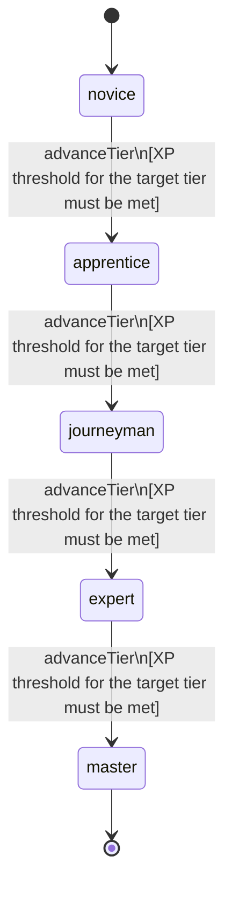

<!-- @generated by @newel/generator-bible — do not edit -->
# ElementalMagic

**Tags:** `skill`

Manipulation of the four classical elements — fire, earth, air, and water. The most broadly accessible magical discipline; balanced against martial skill per the MagicBalancedWithMartial design decision.

> **Goal:** Provide the primary magic combat and utility path, balanced against melee in cost and effect

## Fields

| Name | Type | Required | Description |
| ---- | ---- | -------- | ----------- |
| `id` | uuid | yes |  |
| `tier` | enum (`novice`, `apprentice`, `journeyman`, `expert`, `master`) | yes |  |
| `xpCurve` | enum (`linear`, `quadratic`, `exponential`) | yes | XP required per tier |
| `maxLevel` | integer | yes | Maximum XP level within a tier before tier advance is required |
| `category` | enum (`combat`, `crafting`, `magic`, `exploration`, `social`) | yes | Skill domain: magic |

### State machine

**Field:** `tier` &nbsp; **Initial:** `novice`

| State | Description | Terminal |
| ----- | ----------- | -------- |
| `novice` | Entry-level practitioner; basic techniques only |  |
| `apprentice` | Growing competence; intermediate techniques unlock |  |
| `journeyman` | Solid practitioner; advanced techniques and profession gates open |  |
| `expert` | Near-mastery; most advanced abilities available |  |
| `master` | Complete mastery; all abilities unlocked | yes |

| From | To | Trigger | Guards | Effects |
| ---- | --- | ------- | ------ | ------- |
| `novice` | `apprentice` | `advanceTier` | XP threshold for the target tier must be met |  |
| `apprentice` | `journeyman` | `advanceTier` | XP threshold for the target tier must be met |  |
| `journeyman` | `expert` | `advanceTier` | XP threshold for the target tier must be met |  |
| `expert` | `master` | `advanceTier` | XP threshold for the target tier must be met |  |

## Behaviors

### `advanceTier`

Progress to the next mastery tier through accumulated elemental XP

**Rules:**
- XP threshold for the target tier must be met

**Auth:** `maintainer`

### `castElementalBolt`

Hurl a single-element bolt of fire, earth, air, or water at a target

**Rules:**
- Requires Elemental Magic: Apprentice

**Auth:** `maintainer`

### `castElementalField`

Conjure a persistent area-of-effect field that applies elemental conditions

**Rules:**
- Requires Elemental Magic: Journeyman

**Auth:** `maintainer`

### `castElementalStorm`

Unleash a wide elemental storm; high mana cost, massive area damage

**Rules:**
- Requires Elemental Magic: Expert

**Auth:** `maintainer`

