<!-- @generated by @newel/generator-bible — do not edit -->
# EnchantedAethermiteShard

**Tags:** `item`

A refined aethermite shard that has been fully imbued at an arcane forge. Emits a faint silver glow; consumed as a single-use catalyst when enchanting metals or imbuing equipment.

> **Goal:** Primary enchanting catalyst; creates scarcity that balances the enchanting economy

## Fields

| Name | Type | Required | Description |
| ---- | ---- | -------- | ----------- |
| `id` | uuid | yes |  |
| `condition` | enum (`pristine`, `worn`, `damaged`, `broken`) | yes |  |
| `weight` | decimal | yes | kg per shard |
| `rarity` | enum (`common`, `uncommon`, `rare`, `epic`, `legendary`) | yes |  |
| `stackable` | boolean | yes | True; stacks up to 10 per slot |
| `durability` | integer | yes | Charge level; 0 means the shard is spent |

## Relations

| Name | Kind | Target | Foreign Key |
| ---- | ---- | ------ | ----------- |
| `aethermite` | hasOne | [Aethermite](aethermite.md) |  |

### State machine

**Field:** `condition` &nbsp; **Initial:** `pristine`

```mermaid
stateDiagram-v2
  [*] --> pristine
  pristine --> worn : degrade\n[Exposed to sunlight: charge degrades one tier per in-game day]
  worn --> damaged : degrade\n[Exposed to sunlight: charge degrades one tier per in-game day]
  damaged --> broken : degrade\n[Exposed to sunlight: charge degrades one tier per in-game day]
  broken --> pristine : repair\n[Requires Arcane Forging: Journeyman; Recharging costs one aethermite dust and restores condition to pristine]
  damaged --> pristine : repair\n[Requires Arcane Forging: Journeyman; Recharging costs one aethermite dust and restores condition to pristine]
  worn --> pristine : repair\n[Requires Arcane Forging: Journeyman; Recharging costs one aethermite dust and restores condition to pristine]
```

| State | Description | Terminal |
| ----- | ----------- | -------- |
| `pristine` | Freshly crafted or repaired; full stat effectiveness |  |
| `worn` | Showing use; minor stat penalties apply |  |
| `damaged` | Significantly degraded; notable stat penalties; repair strongly advised |  |
| `broken` | Unusable; must be repaired at a workshop before use |  |

| From | To | Trigger | Guards | Effects |
| ---- | --- | ------- | ------ | ------- |
| `pristine` | `worn` | `degrade` | Exposed to sunlight: charge degrades one tier per in-game day |  |
| `worn` | `damaged` | `degrade` | Exposed to sunlight: charge degrades one tier per in-game day |  |
| `damaged` | `broken` | `degrade` | Exposed to sunlight: charge degrades one tier per in-game day |  |
| `broken` | `pristine` | `repair` | Requires Arcane Forging: Journeyman; Recharging costs one aethermite dust and restores condition to pristine |  |
| `damaged` | `pristine` | `repair` | Requires Arcane Forging: Journeyman; Recharging costs one aethermite dust and restores condition to pristine |  |
| `worn` | `pristine` | `repair` | Requires Arcane Forging: Journeyman; Recharging costs one aethermite dust and restores condition to pristine |  |

## Behaviors

### `degrade`

Charge dissipates slowly when not stored in a magical container

**Rules:**
- Exposed to sunlight: charge degrades one tier per in-game day

**Auth:** `maintainer`

### `repair`

A fully discharged shard can be recharged at an arcane forge

**Rules:**
- Requires Arcane Forging: Journeyman
- Recharging costs one aethermite dust and restores condition to pristine

**Auth:** `maintainer`

