<!-- @generated by @newel/generator-bible — do not edit -->
# Ferrite

**Tags:** `material`

Common dark-grey metal found in surface veins across temperate biomes, volcanic lava-tube edges, and stabilised sections of void rifts. Abundant but brittle when thin; the backbone of early-game tooling.

> **Goal:** Serve as the entry-level metallic material, readily available to new players

## Fields

| Name | Type | Required | Description |
| ---- | ---- | -------- | ----------- |
| `id` | uuid | yes |  |
| `state` | enum (`raw`, `refined`, `enchanted`) | yes |  |
| `density` | decimal | yes | g/cm³; governs item weight |
| `hardness` | decimal | yes | Mohs-equivalent scale 1–10 |
| `conductivity` | decimal | yes | Thermal conductivity rating 0–1 |
| `magicAffinity` | decimal | yes | Capacity to hold enchantment 0–1 |

### State machine

**Field:** `state` &nbsp; **Initial:** `raw`

```mermaid
stateDiagram-v2
  [*] --> raw
  raw --> refined : refine\n[Requires a functional forge structure; Two raw ferrite ore yield one refined ingot]
  refined --> enchanted : enchant\n[Ferrite holds weak enchantments only; magical capacity capped at 0.3; Enchanting consumes one enchanted aethermite shard as a catalyst; Aethermite.consume is invoked on the spent shard — the shard transitions to consumed state and is removed from inventory entirely]
  enchanted --> [*]
```

| State | Description | Terminal |
| ----- | ----------- | -------- |
| `raw` | Ore or unprocessed form; must be smelted or worked before use |  |
| `refined` | Processed ingot or sheet; ready for crafting |  |
| `enchanted` | Imbued with magical energy at an arcane forge | yes |

| From | To | Trigger | Guards | Effects |
| ---- | --- | ------- | ------ | ------- |
| `raw` | `refined` | `refine` | Requires a functional forge structure; Two raw ferrite ore yield one refined ingot |  |
| `refined` | `enchanted` | `enchant` | Ferrite holds weak enchantments only; magical capacity capped at 0.3; Enchanting consumes one enchanted aethermite shard as a catalyst; Aethermite.consume is invoked on the spent shard — the shard transitions to consumed state and is removed from inventory entirely |  |

## Behaviors

### `refine`

Smelt raw ferrite ore into refined ingots at a forge

**Rules:**
- Requires a functional forge structure
- Two raw ferrite ore yield one refined ingot

**Auth:** `maintainer`

### `enchant`

Imbue a refined ingot at an arcane forge to unlock enchanted state

**Rules:**
- Ferrite holds weak enchantments only; magical capacity capped at 0.3
- Enchanting consumes one enchanted aethermite shard as a catalyst; Aethermite.consume is invoked on the spent shard — the shard transitions to consumed state and is removed from inventory entirely

**Auth:** `maintainer`

