<!-- @generated by @newel/generator-bible — do not edit -->
# FerriteIngot

**Tags:** `item`

Smelted ferrite bar ready for smithing. The most common crafting intermediate; used in tools, weapons, armour, and as a construction material for forges and workshops.

> **Goal:** Backbone crafting component; drives early-game trade and material loops

## Fields

| Name | Type | Required | Description |
| ---- | ---- | -------- | ----------- |
| `id` | uuid | yes |  |
| `condition` | enum (`pristine`, `worn`, `damaged`, `broken`) | yes |  |
| `weight` | decimal | yes | kg per ingot |
| `rarity` | enum (`common`, `uncommon`, `rare`, `epic`, `legendary`) | yes |  |
| `stackable` | boolean | yes | True; stacks up to 50 per slot |
| `durability` | integer | yes | Structural integrity; degrades only under deliberate stress |

## Relations

| Name | Kind | Target | Foreign Key |
| ---- | ---- | ------ | ----------- |
| `ferrite` | hasOne | [Ferrite](ferrite.md) |  |

### State machine

**Field:** `condition` &nbsp; **Initial:** `pristine`

```mermaid
stateDiagram-v2
  [*] --> pristine
  pristine --> worn : degrade\n[Normal inventory storage never degrades an ingot]
  worn --> damaged : degrade\n[Normal inventory storage never degrades an ingot]
  damaged --> broken : degrade\n[Normal inventory storage never degrades an ingot]
  broken --> pristine : repair\n[Requires a forge; no additional materials consumed]
  damaged --> pristine : repair\n[Requires a forge; no additional materials consumed]
  worn --> pristine : repair\n[Requires a forge; no additional materials consumed]
```

| State | Description | Terminal |
| ----- | ----------- | -------- |
| `pristine` | Freshly crafted or repaired; full stat effectiveness |  |
| `worn` | Showing use; minor stat penalties apply |  |
| `damaged` | Significantly degraded; notable stat penalties; repair strongly advised |  |
| `broken` | Unusable; must be repaired at a workshop before use |  |

| From | To | Trigger | Guards | Effects |
| ---- | --- | ------- | ------ | ------- |
| `pristine` | `worn` | `degrade` | Normal inventory storage never degrades an ingot |  |
| `worn` | `damaged` | `degrade` | Normal inventory storage never degrades an ingot |  |
| `damaged` | `broken` | `degrade` | Normal inventory storage never degrades an ingot |  |
| `broken` | `pristine` | `repair` | Requires a forge; no additional materials consumed |  |
| `damaged` | `pristine` | `repair` | Requires a forge; no additional materials consumed |  |
| `worn` | `pristine` | `repair` | Requires a forge; no additional materials consumed |  |

## Behaviors

### `degrade`

Ingot degrades only when used as a structural load-bearing component in a damaged building

**Rules:**
- Normal inventory storage never degrades an ingot

**Auth:** `maintainer`

### `repair`

Re-smelt a degraded ingot back to pristine quality

**Rules:**
- Requires a forge; no additional materials consumed

**Auth:** `maintainer`

