<!-- @generated by @newel/generator-bible — do not edit -->
# FerritePick

**Tags:** `item`

Rough-hewn mining pick forged from ferrite ingots and a thornwood handle. The standard tool for extracting surface ore veins; wears quickly against hard rock.

> **Goal:** Entry-level mining tool; gates ore gathering for new players

## Fields

| Name | Type | Required | Description |
| ---- | ---- | -------- | ----------- |
| `id` | uuid | yes |  |
| `condition` | enum (`pristine`, `worn`, `damaged`, `broken`) | yes |  |
| `weight` | decimal | yes | kg; affects carry capacity |
| `rarity` | enum (`common`, `uncommon`, `rare`, `epic`, `legendary`) | yes |  |
| `stackable` | boolean | yes | Whether multiple instances stack in inventory |
| `durability` | integer | yes | Remaining durability points before condition degrades |
| `toolType` | string | yes | Tool class — the action this tool performs. "pick" mines, "axe" chops. |

## Relations

| Name | Kind | Target | Foreign Key |
| ---- | ---- | ------ | ----------- |
| `ferrite` | hasOne | [Ferrite](ferrite.md) |  |
| `thornwood` | hasOne | [Thornwood](thornwood.md) |  |

### State machine

**Field:** `condition` &nbsp; **Initial:** `pristine`

```mermaid
stateDiagram-v2
  [*] --> pristine
  pristine --> worn : degrade\n[Each mining action consumes durability points scaled by rock hardness]
  worn --> damaged : degrade\n[Each mining action consumes durability points scaled by rock hardness]
  damaged --> broken : degrade\n[Each mining action consumes durability points scaled by rock hardness]
  broken --> pristine : repair\n[Requires a functional forge; Repair costs one ferrite ingot per condition tier restored]
  damaged --> pristine : repair\n[Requires a functional forge; Repair costs one ferrite ingot per condition tier restored]
  worn --> pristine : repair\n[Requires a functional forge; Repair costs one ferrite ingot per condition tier restored]
```

| State | Description | Terminal |
| ----- | ----------- | -------- |
| `pristine` | Freshly crafted or repaired; full stat effectiveness |  |
| `worn` | Showing use; minor stat penalties apply |  |
| `damaged` | Significantly degraded; notable stat penalties; repair strongly advised |  |
| `broken` | Unusable; must be repaired at a workshop before use |  |

| From | To | Trigger | Guards | Effects |
| ---- | --- | ------- | ------ | ------- |
| `pristine` | `worn` | `degrade` | Each mining action consumes durability points scaled by rock hardness |  |
| `worn` | `damaged` | `degrade` | Each mining action consumes durability points scaled by rock hardness |  |
| `damaged` | `broken` | `degrade` | Each mining action consumes durability points scaled by rock hardness |  |
| `broken` | `pristine` | `repair` | Requires a functional forge; Repair costs one ferrite ingot per condition tier restored |  |
| `damaged` | `pristine` | `repair` | Requires a functional forge; Repair costs one ferrite ingot per condition tier restored |  |
| `worn` | `pristine` | `repair` | Requires a functional forge; Repair costs one ferrite ingot per condition tier restored |  |

## Behaviors

### `degrade`

Reduce durability after mining use; condition worsens when durability threshold crossed

**Rules:**
- Each mining action consumes durability points scaled by rock hardness

**Auth:** `maintainer`

### `repair`

Restore item to pristine condition at a forge using raw ferrite

**Rules:**
- Requires a functional forge
- Repair costs one ferrite ingot per condition tier restored

**Auth:** `maintainer`

