<!-- @generated by @newel/generator-bible — do not edit -->
# FieldRations

**Tags:** `item`

Dried grain-and-herb ration pack prepared from temperate grassland crops. Restores a modest amount of stamina and prevents hunger debuff for several in-game hours.

> **Goal:** Basic consumable food; encourages players to invest in agriculture as a supply chain

## Fields

| Name | Type | Required | Description |
| ---- | ---- | -------- | ----------- |
| `id` | uuid | yes |  |
| `condition` | enum (`pristine`, `worn`, `damaged`, `broken`) | yes |  |
| `weight` | decimal | yes | kg per unit |
| `rarity` | enum (`common`, `uncommon`, `rare`, `epic`, `legendary`) | yes |  |
| `stackable` | boolean | yes | True; stacks up to 20 per slot |
| `durability` | integer | yes | Freshness; hits 0 when spoiled |

### State machine

**Field:** `condition` &nbsp; **Initial:** `pristine`

```mermaid
stateDiagram-v2
  [*] --> pristine
  pristine --> worn : degrade\n[Stored in a cold-cellar structure: degradation rate halved; When condition reaches broken the ration is spoiled and cannot be consumed]
  worn --> damaged : degrade\n[Stored in a cold-cellar structure: degradation rate halved; When condition reaches broken the ration is spoiled and cannot be consumed]
  damaged --> broken : degrade\n[Stored in a cold-cellar structure: degradation rate halved; When condition reaches broken the ration is spoiled and cannot be consumed]
  broken --> [*]
```

| State | Description | Terminal |
| ----- | ----------- | -------- |
| `pristine` | Full potency or freshness; ready for use |  |
| `worn` | Reduced potency; still usable |  |
| `damaged` | Significantly degraded; use with caution |  |
| `broken` | Spoiled or fully depleted; cannot be used or repaired | yes |

| From | To | Trigger | Guards | Effects |
| ---- | --- | ------- | ------ | ------- |
| `pristine` | `worn` | `degrade` | Stored in a cold-cellar structure: degradation rate halved; When condition reaches broken the ration is spoiled and cannot be consumed |  |
| `worn` | `damaged` | `degrade` | Stored in a cold-cellar structure: degradation rate halved; When condition reaches broken the ration is spoiled and cannot be consumed |  |
| `damaged` | `broken` | `degrade` | Stored in a cold-cellar structure: degradation rate halved; When condition reaches broken the ration is spoiled and cannot be consumed |  |

## Behaviors

### `degrade`

Food freshness degrades over real time

**Rules:**
- Stored in a cold-cellar structure: degradation rate halved
- When condition reaches broken the ration is spoiled and cannot be consumed

**Auth:** `maintainer`

