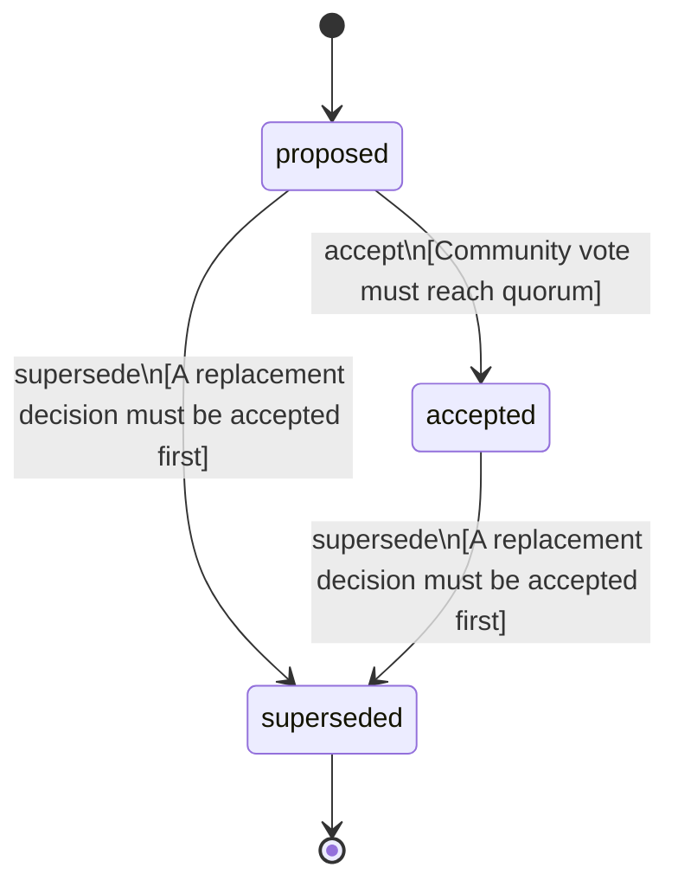

<!-- @generated by @newel/generator-bible — do not edit -->
# GodotEngine

**Tags:** `decision`

Use Godot 4.x as the game client engine. Chosen for its open-source license, GDScript ergonomics, and strong 3D/networking support.

> **Goal:** Lock in the client technology so all rendering, physics, and scripting work targets a single platform

## Fields

| Name | Type | Required | Description |
| ---- | ---- | -------- | ----------- |
| `id` | uuid | yes |  |
| `status` | enum (`proposed`, `accepted`, `superseded`) | yes |  |

### State machine

**Field:** `status` &nbsp; **Initial:** `proposed`

| State | Description | Terminal |
| ----- | ----------- | -------- |
| `proposed` | Decision is under community discussion |  |
| `accepted` | Decision is ratified and in effect |  |
| `superseded` | Decision has been replaced by a newer decision | yes |

| From | To | Trigger | Guards | Effects |
| ---- | --- | ------- | ------ | ------- |
| `proposed` | `accepted` | `accept` | Community vote must reach quorum |  |
| `proposed`, `accepted` | `superseded` | `supersede` | A replacement decision must be accepted first |  |

## Behaviors

### `accept`

Ratify this decision after community review

**Rules:**
- Community vote must reach quorum

**Auth:** `maintainer`

### `supersede`

Mark this decision as replaced by a newer one

**Rules:**
- A replacement decision must be accepted first

**Auth:** `maintainer`

