<!-- @generated by @newel/generator-bible — do not edit -->
# GovernanceSystem

**Tags:** `world-system`

Defines the rules of in-game community governance. Players submit proposals, others vote, and a proposal ratifies only once a quorum of distinct voters has cast ballots within a voting window and a threshold fraction favour the change. The proposal author cannot vote on their own proposal.

> **Goal:** Ground the CommunityOwnsTheFuture principle in anti-gaming governance mechanics (quorum, window, no self-vote)

## Fields

| Name | Type | Required | Description |
| ---- | ---- | -------- | ----------- |
| `id` | uuid | yes |  |
| `ratification` | json | yes | Ratification parameters: threshold (fraction of cast votes that must favour), quorum (minimum distinct voters), windowSeconds (voting window before the proposal closes). |
| `guildMinTier` | string | yes | Minimum Leadership tier required to form a guild |
| `status` | enum (`proposed`, `accepted`, `superseded`, `expired`) | yes | Lifecycle of a proposal: open for voting, ratified, replaced, or lapsed past its window |

### State machine

**Field:** `status` &nbsp; **Initial:** `proposed`

```mermaid
stateDiagram-v2
  [*] --> proposed
  proposed --> accepted : ratify\n[The proposal author may not vote on their own proposal; Ratification requires at least quorum distinct voters; Votes after the voting window closes are rejected; A ratified proposal is recorded in the runtime decisions log]
  proposed --> expired : expire\n[A proposal past its window deadline transitions to expired; Expired proposals no longer accept votes]
  proposed --> superseded : supersede\n[A replacement proposal must be ratified first]
  accepted --> superseded : supersede\n[A replacement proposal must be ratified first]
  superseded --> [*]
  expired --> [*]
```

| State | Description | Terminal |
| ----- | ----------- | -------- |
| `proposed` | Proposal is open for community voting within its window |  |
| `accepted` | Proposal ratified and recorded in the decisions log |  |
| `superseded` | Proposal replaced by a newer one | yes |
| `expired` | Voting window lapsed without ratification | yes |

| From | To | Trigger | Guards | Effects |
| ---- | --- | ------- | ------ | ------- |
| `proposed` | `accepted` | `ratify` | The proposal author may not vote on their own proposal; Ratification requires at least quorum distinct voters; Votes after the voting window closes are rejected; A ratified proposal is recorded in the runtime decisions log |  |
| `proposed` | `expired` | `expire` | A proposal past its window deadline transitions to expired; Expired proposals no longer accept votes |  |
| `proposed`, `accepted` | `superseded` | `supersede` | A replacement proposal must be ratified first |  |

## Behaviors

### `ratify`

Ratify a proposal that has met quorum, threshold, and window

**Rules:**
- The proposal author may not vote on their own proposal
- Ratification requires at least quorum distinct voters
- Votes after the voting window closes are rejected
- A ratified proposal is recorded in the runtime decisions log

**Auth:** `maintainer`

### `expire`

Close a proposal whose voting window has lapsed without ratification

**Rules:**
- A proposal past its window deadline transitions to expired
- Expired proposals no longer accept votes

**Auth:** `maintainer`

### `supersede`

Mark a proposal as replaced by a newer one

**Rules:**
- A replacement proposal must be ratified first

**Auth:** `maintainer`

