<!-- @generated by @newel/generator-bible — do not edit -->
# GraywolfPack

**Tags:** `creature`

A coordinated hunting pack of gray wolves that roam temperate forest edges and clearings. Individual wolves are manageable; the pack tactics make them deadly to lone travellers. Taming a pup from a defeated pack unlocks the Ranger profession bonus.

> **Goal:** Introduce group AI tactics and the taming mechanic; reward skilled solo hunters over raw power

## Fields

| Name | Type | Required | Description |
| ---- | ---- | -------- | ----------- |
| `id` | uuid | yes |  |
| `state` | enum (`idle`, `alert`, `aggressive`, `fleeing`, `dead`, `respawning`) | yes |  |
| `tier` | enum (`1`, `2`, `3`, `4`, `5`) | yes | Combat difficulty tier |
| `aggressionLevel` | enum (`passive`, `neutral`, `aggressive`, `territorial`) | yes |  |
| `baseHp` | integer | yes | Hit points per wolf at tier baseline |
| `baseDamage` | integer | yes | Damage per bite at tier baseline |
| `alertRadius` | decimal | yes | Distance in metres at which creature enters alert state |
| `attackRadius` | decimal | yes | Distance in metres at which creature begins attacking |
| `fleeThreshold` | decimal | yes | HP fraction (0–1) below which creature flees |
| `respawnSeconds` | integer | yes | Seconds before a dead creature respawns |
| `spawnCount` | integer | yes | Number of instances spawned per game world |
| `biome` | enum (`TemperateForest`, `TemperateGrassland`, `VolcanicBadlands`, `TwilightGrove`, `VoidRift`) | yes | Biome this creature belongs to |
| `drops` | json | yes | Structured drop table: raw drop item key, drop chance (0–1), and quantity range [minQty, maxQty]. Rolled independently per kill by the loot system. |

### State machine

**Field:** `state` &nbsp; **Initial:** `idle`

```mermaid
stateDiagram-v2
  [*] --> idle
  idle --> alert : detect\n[Lead wolf detects within 12 tile radius; pack shares the alert state instantly; Pack fires attack trigger directly from idle (no alert phase) if player is carrying raw meat]
  idle --> aggressive : detect\n[Lead wolf detects within 12 tile radius; pack shares the alert state instantly; Pack fires attack trigger directly from idle (no alert phase) if player is carrying raw meat]
  alert --> aggressive : attack\n[Two wolves attempt to flank; remaining wolves attack the front; Flanking wolf deals 1.5× baseDamage if attack lands from behind]
  alert --> idle : calm\n[Pack returns to patrol route 60 seconds after losing target]
  aggressive --> dead : die\n[Each wolf dies independently; pack is considered dead when all wolves reach the dead state]
  aggressive --> idle : calm\n[Pack returns to patrol route 60 seconds after losing target]
  alert --> fleeing : flee\n[Surviving wolves flee independently; they do not regroup during the same spawn cycle]
  aggressive --> fleeing : flee\n[Surviving wolves flee independently; they do not regroup during the same spawn cycle]
  fleeing --> dead : die\n[Each wolf dies independently; pack is considered dead when all wolves reach the dead state]
  fleeing --> idle : calm\n[Pack returns to patrol route 60 seconds after losing target]
  fleeing --> aggressive : attack\n[Two wolves attempt to flank; remaining wolves attack the front; Flanking wolf deals 1.5× baseDamage if attack lands from behind]
  dead --> respawning : respawn\n[Respawn cooldown: 15 in-game minutes; pup does not respawn if tamed]
  respawning --> idle : calm\n[Pack returns to patrol route 60 seconds after losing target]
```

| State | Description | Terminal |
| ----- | ----------- | -------- |
| `idle` | Creature is at rest; not pursuing any target |  |
| `alert` | Creature has detected a threat; preparing to fight or flee |  |
| `aggressive` | Creature is actively attacking a target |  |
| `fleeing` | Creature is retreating from danger; cannot attack |  |
| `dead` | Creature has been killed; drops are available |  |
| `respawning` | Creature is regenerating at its spawn point; not yet interactable |  |

| From | To | Trigger | Guards | Effects |
| ---- | --- | ------- | ------ | ------- |
| `idle` | `alert` | `detect` | Lead wolf detects within 12 tile radius; pack shares the alert state instantly; Pack fires attack trigger directly from idle (no alert phase) if player is carrying raw meat |  |
| `idle` | `aggressive` | `detect` | Lead wolf detects within 12 tile radius; pack shares the alert state instantly; Pack fires attack trigger directly from idle (no alert phase) if player is carrying raw meat |  |
| `alert` | `aggressive` | `attack` | Two wolves attempt to flank; remaining wolves attack the front; Flanking wolf deals 1.5× baseDamage if attack lands from behind |  |
| `alert` | `idle` | `calm` | Pack returns to patrol route 60 seconds after losing target |  |
| `aggressive` | `dead` | `die` | Each wolf dies independently; pack is considered dead when all wolves reach the dead state |  |
| `aggressive` | `idle` | `calm` | Pack returns to patrol route 60 seconds after losing target |  |
| `alert` | `fleeing` | `flee` | Surviving wolves flee independently; they do not regroup during the same spawn cycle |  |
| `aggressive` | `fleeing` | `flee` | Surviving wolves flee independently; they do not regroup during the same spawn cycle |  |
| `fleeing` | `dead` | `die` | Each wolf dies independently; pack is considered dead when all wolves reach the dead state |  |
| `fleeing` | `idle` | `calm` | Pack returns to patrol route 60 seconds after losing target |  |
| `fleeing` | `aggressive` | `attack` | Two wolves attempt to flank; remaining wolves attack the front; Flanking wolf deals 1.5× baseDamage if attack lands from behind |  |
| `dead` | `respawning` | `respawn` | Respawn cooldown: 15 in-game minutes; pup does not respawn if tamed |  |
| `respawning` | `idle` | `calm` | Pack returns to patrol route 60 seconds after losing target |  |

## Behaviors

### `detect`

The lead wolf detects prey; pack transitions to alert simultaneously

**Rules:**
- Lead wolf detects within 12 tile radius; pack shares the alert state instantly
- Pack fires attack trigger directly from idle (no alert phase) if player is carrying raw meat

**Auth:** `maintainer`

### `attack`

Pack flanking attack — wolves surround the target and attack in sequence

**Rules:**
- Two wolves attempt to flank; remaining wolves attack the front
- Flanking wolf deals 1.5× baseDamage if attack lands from behind

**Auth:** `maintainer`

### `flee`

Pack disbands and flees when lead wolf is killed

**Rules:**
- Surviving wolves flee independently; they do not regroup during the same spawn cycle

**Auth:** `maintainer`

### `die`

Transition individual wolf (or full pack) to dead state; trigger loot drop

**Rules:**
- Each wolf dies independently; pack is considered dead when all wolves reach the dead state

**Auth:** `maintainer`

### `drop`

Drop loot when all wolves in the pack are dead

**Rules:**
- Each wolf drops: wolf pelt (1), wolf fang (0–1, 40% chance)
- Pack alpha drop: alpha wolf fang (1, 100%)

**Auth:** `maintainer`

### `tame`

Tame a surviving pup after defeating the alpha wolf

**Rules:**
- Requires Unarmed: Journeyman
- Player must approach the pup while unarmed; pup is flagged tameable after alpha death
- Taming grants a wolf companion and sets the wolfBondHolder flag; Ranger profession requires this flag in addition to its skill prerequisites

**Auth:** `maintainer`

### `respawn`

Pack reforms at its territory spawn point after cooldown

**Rules:**
- Respawn cooldown: 15 in-game minutes; pup does not respawn if tamed

**Auth:** `maintainer`

### `calm`

Return to idle when no prey is detected

**Rules:**
- Pack returns to patrol route 60 seconds after losing target

**Auth:** `maintainer`

