<!-- @generated by @newel/generator-bible — do not edit -->
# Inventory

**Tags:** `player`

The container of items carried by a single player. Weight and slot limits enforce the survival economy; exceeding either blocks pickups. Inventory contents are persisted server-side and restored on login.

> **Goal:** Define the rules governing what a player can carry, how items stack, and when the full state is reached

## Fields

| Name | Type | Required | Description |
| ---- | ---- | -------- | ----------- |
| `id` | uuid | yes |  |
| `state` | enum (`open`, `closed`, `full`) | yes |  |
| `maxSlots` | integer | yes | Maximum number of distinct item stacks |
| `maxWeightKg` | decimal | yes | Maximum total carry weight in kilograms |
| `usedSlots` | integer | yes | Current number of occupied stacks |
| `currentWeightKg` | decimal | yes | Sum of (item.weight × quantity) for all stacks |

### State machine

**Field:** `state` &nbsp; **Initial:** `closed`

```mermaid
stateDiagram-v2
  [*] --> closed
  closed --> open : open\n[Blocked during combat animations; otherwise always permitted]
  open --> closed : close\n[Always permitted]
  open --> full : fill\n[Triggered automatically after every successful pickup that saturates either limit]
  closed --> full : fill\n[Triggered automatically after every successful pickup that saturates either limit]
  full --> open : open\n[Blocked during combat animations; otherwise always permitted]
  full --> closed : close\n[Always permitted]
```

| State | Description | Terminal |
| ----- | ----------- | -------- |
| `open` | Inventory UI is visible; player can manage, equip, or drop items |  |
| `closed` | Inventory UI is hidden; passive weight and slot checks still apply |  |
| `full` | All slots and weight capacity are at maximum; pickups are rejected |  |

| From | To | Trigger | Guards | Effects |
| ---- | --- | ------- | ------ | ------- |
| `closed` | `open` | `open` | Blocked during combat animations; otherwise always permitted |  |
| `open` | `closed` | `close` | Always permitted |  |
| `open` | `full` | `fill` | Triggered automatically after every successful pickup that saturates either limit |  |
| `closed` | `full` | `fill` | Triggered automatically after every successful pickup that saturates either limit |  |
| `full` | `open` | `open` | Blocked during combat animations; otherwise always permitted |  |
| `full` | `closed` | `close` | Always permitted |  |

## Behaviors

### `pickup`

Add a world-dropped item to the inventory

**Rules:**
- Rejected if state is full
- Stackable items merge into an existing stack if one exists; otherwise a new slot is consumed
- Weight is recalculated on every pickup; if the result would exceed maxWeightKg, the pickup is rejected
- Emits an item_picked_up event with the item id and quantity

**Auth:** `maintainer`

### `drop`

Remove an item from the inventory and place it in the world at the player's position

**Rules:**
- Dropping a full stack frees the slot
- Partial stack drop reduces quantity; slot is freed only when quantity reaches 0
- Equipment currently worn cannot be dropped without first being unequipped

**Auth:** `maintainer`

### `open`

Open the inventory UI

**Rules:**
- Blocked during combat animations; otherwise always permitted

**Auth:** `maintainer`

### `close`

Close the inventory UI

**Rules:**
- Always permitted

**Auth:** `maintainer`

### `fill`

Transition to full state when slots or weight ceiling is reached

**Rules:**
- Triggered automatically after every successful pickup that saturates either limit

**Auth:** `maintainer`

