<!-- @generated by @newel/generator-bible — do not edit -->
# Lumenfite

**Tags:** `material`

Translucent crystalline mineral that absorbs ambient light during the day and releases it slowly at night. Found in shallow cave systems and cliff faces. Valued for lighting infrastructure without open flames.

> **Goal:** Provide a reliable, player-craftable light source that drives infrastructure investment

## Fields

| Name | Type | Required | Description |
| ---- | ---- | -------- | ----------- |
| `id` | uuid | yes |  |
| `state` | enum (`raw`, `dressed`, `inscribed`) | yes |  |
| `density` | decimal | yes | g/cm³; moderate |
| `hardness` | decimal | yes | Mohs equivalent 1–10; brittle, shatters under impact |
| `conductivity` | decimal | yes | Thermal conductivity 0–1; near zero — poor heat conductor despite its light-energy affinity |
| `magicAffinity` | decimal | yes | Capacity to hold enchantment 0–1; high — specialised for light-type magic |

### State machine

**Field:** `state` &nbsp; **Initial:** `raw`

```mermaid
stateDiagram-v2
  [*] --> raw
  raw --> dressed : dress\n[Requires Masonry: Apprentice or Jewellery: Apprentice; Poorly cut shards emit dim scattered light; precision cutting increases brightness radius]
  dressed --> inscribed : inscribe\n[Colour runes change emission spectrum but do not increase brightness; Flux runes must be aligned with the crystal's natural axis or the shard shatters]
  inscribed --> [*]
```

| State | Description | Terminal |
| ----- | ----------- | -------- |
| `raw` | Rough quarried block; heavy but structurally sound |  |
| `dressed` | Cut and smoothed for construction or decorative use |  |
| `inscribed` | Rune-carved by a mason-arcanist; permanently altered by rune-work — enchanted for ashite (ward runes), optically reconfigured for lumenfite (flux runes) | yes |

| From | To | Trigger | Guards | Effects |
| ---- | --- | ------- | ------ | ------- |
| `raw` | `dressed` | `dress` | Requires Masonry: Apprentice or Jewellery: Apprentice; Poorly cut shards emit dim scattered light; precision cutting increases brightness radius |  |
| `dressed` | `inscribed` | `inscribe` | Colour runes change emission spectrum but do not increase brightness; Flux runes must be aligned with the crystal's natural axis or the shard shatters |  |

## Behaviors

### `dress`

Facet raw lumenfite shards to maximise light refraction at a jeweller bench

**Rules:**
- Requires Masonry: Apprentice or Jewellery: Apprentice
- Poorly cut shards emit dim scattered light; precision cutting increases brightness radius

**Auth:** `maintainer`

### `inscribe`

Engrave a flux rune to increase charge capacity or alter emission colour

**Rules:**
- Colour runes change emission spectrum but do not increase brightness
- Flux runes must be aligned with the crystal's natural axis or the shard shatters

**Auth:** `maintainer`

