<!-- @generated by @newel/generator-bible — do not edit -->
# Pathfinder

**Tags:** `profession`

An expert scout and guide who can navigate any terrain invisibly, chart it accurately, and lead groups at full speed. Essential for opening new territories.

> **Goal:** Reward deep exploration investment; create a profession that opens the world for other players

## Fields

| Name | Type | Required | Description |
| ---- | ---- | -------- | ----------- |
| `id` | uuid | yes |  |
| `status` | enum (`locked`, `active`, `mastered`) | yes |  |

## Relations

| Name | Kind | Target | Foreign Key |
| ---- | ---- | ------ | ----------- |
| `navigation` | hasOne | [Navigation](navigation.md) |  |
| `cartography` | hasOne | [Cartography](cartography.md) |  |
| `stealth` | hasOne | [Stealth](stealth.md) |  |

### State machine

**Field:** `status` &nbsp; **Initial:** `locked`

```mermaid
stateDiagram-v2
  [*] --> locked
  locked --> active : unlock\n[Requires Navigation: Journeyman; Requires Cartography: Journeyman; Requires Stealth: Apprentice]
  active --> mastered : master\n[Navigation, Cartography, and Stealth must all be at master tier]
  mastered --> [*]
```

| State | Description | Terminal |
| ----- | ----------- | -------- |
| `locked` | Prerequisite skill tiers not yet met |  |
| `active` | Profession is available to the player; provides passive and active bonuses |  |
| `mastered` | All constituent skills are at master tier; highest-tier profession bonuses active | yes |

| From | To | Trigger | Guards | Effects |
| ---- | --- | ------- | ------ | ------- |
| `locked` | `active` | `unlock` | Requires Navigation: Journeyman; Requires Cartography: Journeyman; Requires Stealth: Apprentice |  |
| `active` | `mastered` | `master` | Navigation, Cartography, and Stealth must all be at master tier |  |

## Behaviors

### `unlock`

Become available when prerequisite exploration skill tiers are reached

**Rules:**
- Requires Navigation: Journeyman
- Requires Cartography: Journeyman
- Requires Stealth: Apprentice

**Auth:** `maintainer`

### `master`

Achieve full mastery when all constituent skills reach master tier

**Rules:**
- Navigation, Cartography, and Stealth must all be at master tier

**Auth:** `maintainer`

