<!-- @generated by @newel/generator-bible — do not edit -->
# Ranger

**Tags:** `profession`

A wilderness specialist who combines ranged combat with reading the environment. Provides the most effective hunting output and can guide expeditions through unmapped terrain.

> **Goal:** Represent the hunting and wilderness-travel profession; bridge combat and exploration

## Fields

| Name | Type | Required | Description |
| ---- | ---- | -------- | ----------- |
| `id` | uuid | yes |  |
| `status` | enum (`locked`, `active`, `mastered`) | yes |  |

## Relations

| Name | Kind | Target | Foreign Key |
| ---- | ---- | ------ | ----------- |
| `archery` | hasOne | [Archery](archery.md) |  |
| `tracking` | hasOne | [Tracking](tracking.md) |  |
| `navigation` | hasOne | [Navigation](navigation.md) |  |
| `unarmed` | hasOne | [Unarmed](unarmed.md) |  |

### State machine

**Field:** `status` &nbsp; **Initial:** `locked`

```mermaid
stateDiagram-v2
  [*] --> locked
  locked --> active : unlock\n[Requires Archery: Journeyman; Requires Tracking: Apprentice; Requires Navigation: Apprentice; Player must hold wolfBondHolder flag — requires taming a GraywolfPack pup, which in turn requires Unarmed: Journeyman]
  active --> mastered : master\n[Archery, Tracking, Navigation, and Unarmed must all be at master tier]
  mastered --> [*]
```

| State | Description | Terminal |
| ----- | ----------- | -------- |
| `locked` | Prerequisite skill tiers not yet met |  |
| `active` | Profession is available to the player; provides passive and active bonuses |  |
| `mastered` | All constituent skills are at master tier; highest-tier profession bonuses active | yes |

| From | To | Trigger | Guards | Effects |
| ---- | --- | ------- | ------ | ------- |
| `locked` | `active` | `unlock` | Requires Archery: Journeyman; Requires Tracking: Apprentice; Requires Navigation: Apprentice; Player must hold wolfBondHolder flag — requires taming a GraywolfPack pup, which in turn requires Unarmed: Journeyman |  |
| `active` | `mastered` | `master` | Archery, Tracking, Navigation, and Unarmed must all be at master tier |  |

## Behaviors

### `unlock`

Become available when prerequisite exploration and combat skill tiers are reached

**Rules:**
- Requires Archery: Journeyman
- Requires Tracking: Apprentice
- Requires Navigation: Apprentice
- Player must hold wolfBondHolder flag — requires taming a GraywolfPack pup, which in turn requires Unarmed: Journeyman

**Auth:** `maintainer`

### `master`

Achieve full mastery when all constituent skills reach master tier

**Rules:**
- Archery, Tracking, Navigation, and Unarmed must all be at master tier

**Auth:** `maintainer`

