<!-- @generated by @newel/generator-bible — do not edit -->
# SteppeBison

**Tags:** `creature`

A massive, shaggy bison that grazes temperate grasslands in loose herds. Slow and passive unless provoked, but a stampede is lethal to unarmoured players. The primary large-game target for grassland settlements; bones are a key structural component.

> **Goal:** Provide a high-yield, high-risk hunt that rewards group play and rewarded preparation

## Fields

| Name | Type | Required | Description |
| ---- | ---- | -------- | ----------- |
| `id` | uuid | yes |  |
| `state` | enum (`idle`, `alert`, `aggressive`, `fleeing`, `dead`, `respawning`) | yes |  |
| `tier` | enum (`1`, `2`, `3`, `4`, `5`) | yes | Combat difficulty tier |
| `aggressionLevel` | enum (`passive`, `neutral`, `aggressive`, `territorial`) | yes |  |
| `baseHp` | integer | yes | Hit points at tier baseline; high value |
| `baseDamage` | integer | yes | Damage per charge at tier baseline |
| `alertRadius` | decimal | yes | Distance in metres at which creature enters alert state |
| `attackRadius` | decimal | yes | Distance in metres at which creature begins attacking |
| `fleeThreshold` | decimal | yes | HP fraction (0–1) below which creature flees |
| `respawnSeconds` | integer | yes | Seconds before a dead creature respawns |
| `spawnCount` | integer | yes | Number of instances spawned per game world |
| `biome` | enum (`TemperateForest`, `TemperateGrassland`, `VolcanicBadlands`, `TwilightGrove`, `VoidRift`) | yes | Biome this creature belongs to |

### State machine

**Field:** `state` &nbsp; **Initial:** `idle`

```mermaid
stateDiagram-v2
  [*] --> idle
  idle --> alert : detect\n[Detects vibration (galloping horses, explosions) within 20 tiles; Scent detection within 6 tiles regardless of stealth skill]
  alert --> aggressive : attack\n[Charge deals 3× baseDamage to first target in path; 1× to any behind; Charge cannot be performed on uphill terrain]
  alert --> idle : calm\n[Returns to idle 2 in-game minutes after losing threat]
  aggressive --> dead : die\n[Emits a death event; surviving herd members do not reset their flee state until cooldown expires]
  aggressive --> idle : calm\n[Returns to idle 2 in-game minutes after losing threat]
  alert --> fleeing : flee\n[Entire herd flees together; players caught in stampede path take 2× baseDamage per second; Fleeing direction is always away from the original threat source]
  aggressive --> fleeing : flee\n[Entire herd flees together; players caught in stampede path take 2× baseDamage per second; Fleeing direction is always away from the original threat source]
  fleeing --> dead : die\n[Emits a death event; surviving herd members do not reset their flee state until cooldown expires]
  fleeing --> idle : calm\n[Returns to idle 2 in-game minutes after losing threat]
  fleeing --> aggressive : attack\n[Charge deals 3× baseDamage to first target in path; 1× to any behind; Charge cannot be performed on uphill terrain]
  dead --> respawning : respawn\n[Respawn cooldown: 20 in-game minutes; herd respawns as a group]
  respawning --> idle : calm\n[Returns to idle 2 in-game minutes after losing threat]
```

| State | Description | Terminal |
| ----- | ----------- | -------- |
| `idle` | Creature is at rest; not pursuing any target |  |
| `alert` | Creature has detected a threat; preparing to fight or flee |  |
| `aggressive` | Creature is actively attacking a target |  |
| `fleeing` | Creature is retreating from danger; cannot attack |  |
| `dead` | Creature has been killed; drops are available |  |
| `respawning` | Creature is regenerating at its spawn point; not yet interactable |  |

| From | To | Trigger | Guards | Effects |
| ---- | --- | ------- | ------ | ------- |
| `idle` | `alert` | `detect` | Detects vibration (galloping horses, explosions) within 20 tiles; Scent detection within 6 tiles regardless of stealth skill |  |
| `alert` | `aggressive` | `attack` | Charge deals 3× baseDamage to first target in path; 1× to any behind; Charge cannot be performed on uphill terrain |  |
| `alert` | `idle` | `calm` | Returns to idle 2 in-game minutes after losing threat |  |
| `aggressive` | `dead` | `die` | Emits a death event; surviving herd members do not reset their flee state until cooldown expires |  |
| `aggressive` | `idle` | `calm` | Returns to idle 2 in-game minutes after losing threat |  |
| `alert` | `fleeing` | `flee` | Entire herd flees together; players caught in stampede path take 2× baseDamage per second; Fleeing direction is always away from the original threat source |  |
| `aggressive` | `fleeing` | `flee` | Entire herd flees together; players caught in stampede path take 2× baseDamage per second; Fleeing direction is always away from the original threat source |  |
| `fleeing` | `dead` | `die` | Emits a death event; surviving herd members do not reset their flee state until cooldown expires |  |
| `fleeing` | `idle` | `calm` | Returns to idle 2 in-game minutes after losing threat |  |
| `fleeing` | `aggressive` | `attack` | Charge deals 3× baseDamage to first target in path; 1× to any behind; Charge cannot be performed on uphill terrain |  |
| `dead` | `respawning` | `respawn` | Respawn cooldown: 20 in-game minutes; herd respawns as a group |  |
| `respawning` | `idle` | `calm` | Returns to idle 2 in-game minutes after losing threat |  |

## Behaviors

### `detect`

Sense a threat through ground vibration and scent

**Rules:**
- Detects vibration (galloping horses, explosions) within 20 tiles
- Scent detection within 6 tiles regardless of stealth skill

**Auth:** `maintainer`

### `attack`

Stampede charge in a straight line through the target

**Rules:**
- Charge deals 3× baseDamage to first target in path; 1× to any behind
- Charge cannot be performed on uphill terrain

**Auth:** `maintainer`

### `flee`

Herd stampedes away from threat, dangerous to nearby players

**Rules:**
- Entire herd flees together; players caught in stampede path take 2× baseDamage per second
- Fleeing direction is always away from the original threat source

**Auth:** `maintainer`

### `die`

Transition to dead state; trigger loot drop and start respawn timer

**Rules:**
- Emits a death event; surviving herd members do not reset their flee state until cooldown expires

**Auth:** `maintainer`

### `drop`

Drop loot on death

**Rules:**
- Always drops: bison meat (3–6), bison hide (2), bison bone (1–2)
- Chance drop: bison horn (25%)

**Auth:** `maintainer`

### `respawn`

Respawn at the herd centre point after cooldown

**Rules:**
- Respawn cooldown: 20 in-game minutes; herd respawns as a group

**Auth:** `maintainer`

### `calm`

Herd settles back to grazing after threat passes

**Rules:**
- Returns to idle 2 in-game minutes after losing threat

**Auth:** `maintainer`

