<!-- @generated by @newel/generator-bible — do not edit -->
# TechBasicCarpentry

**Tags:** `technology`

Foundation woodworking knowledge. Unlocks the carpentry bench, plank milling, and basic wood-component recipes.

> **Goal:** Root node of the carpentry tree; parallel to basic smithing for wood-primary builds

## Fields

| Name | Type | Required | Description |
| ---- | ---- | -------- | ----------- |
| `id` | uuid | yes |  |
| `status` | enum (`locked`, `researching`, `unlocked`) | yes |  |
| `researchCost` | integer | yes | Research points required to complete |
| `tier` | integer | yes | Technology tree tier (1 = root) |

## Relations

| Name | Kind | Target | Foreign Key |
| ---- | ---- | ------ | ----------- |
| `unlocksRecipeThornwoodPlank` | hasOne | [RecipeThornwoodPlank](recipethornwoodplank.md) |  |
| `unlocksRecipeCarpenterAxe` | hasOne | [RecipeCarpenterAxe](recipecarpenteraxe.md) |  |
| `unlocksRecipeAshiteBlock` | hasOne | [RecipeAshiteBlock](recipeashiteblock.md) |  |

### State machine

**Field:** `status` &nbsp; **Initial:** `locked`

```mermaid
stateDiagram-v2
  [*] --> locked
  locked --> researching : beginResearch\n[No prerequisites; requires a stockpile of thornwood logs]
  researching --> unlocked : completeResearch\n[Research cost fully paid]
  unlocked --> [*]
```

| State | Description | Terminal |
| ----- | ----------- | -------- |
| `locked` | Prerequisites not yet met; technology is not visible in the research interface |  |
| `researching` | Player or guild has committed resources; research progresses over time |  |
| `unlocked` | Research complete; all associated recipes and abilities are available | yes |

| From | To | Trigger | Guards | Effects |
| ---- | --- | ------- | ------ | ------- |
| `locked` | `researching` | `beginResearch` | No prerequisites; requires a stockpile of thornwood logs |  |
| `researching` | `unlocked` | `completeResearch` | Research cost fully paid |  |

## Behaviors

### `beginResearch`

Commit resources to basic carpentry research

**Rules:**
- No prerequisites; requires a stockpile of thornwood logs

**Auth:** `maintainer`

### `completeResearch`

Finish research and unlock carpentry bench blueprint and wood recipes

**Rules:**
- Research cost fully paid

**Auth:** `maintainer`

