<!-- @generated by @newel/generator-bible — do not edit -->
# TechMasterForge

**Tags:** `technology`

Advanced forge construction and temperature-control techniques. Unlocks the master forge structure and veilsteel recipes. Requires basic smithing and a supply of ashite blocks.

> **Goal:** Mid-tier smithing unlock; drives cross-biome supply chains (volcanic ashite to temperate smiths)

## Fields

| Name | Type | Required | Description |
| ---- | ---- | -------- | ----------- |
| `id` | uuid | yes |  |
| `status` | enum (`locked`, `researching`, `unlocked`) | yes |  |
| `researchCost` | integer | yes | Research points required to complete |
| `tier` | integer | yes | Technology tree tier |

## Relations

| Name | Kind | Target | Foreign Key |
| ---- | ---- | ------ | ----------- |
| `requiresTechBasicSmithing` | hasOne | [TechBasicSmithing](techbasicsmithing.md) |  |
| `unlocksRecipeVeilsteelIngot` | hasOne | [RecipeVeilsteelIngot](recipeveilsteelingot.md) |  |
| `unlocksRecipeVeilsteelLongsword` | hasOne | [RecipeVeilsteelLongsword](recipeveilsteellongsword.md) |  |
| `unlocksRecipeVeilsteelChestplate` | hasOne | [RecipeVeilsteelChestplate](recipeveilsteelchestplate.md) |  |

### State machine

**Field:** `status` &nbsp; **Initial:** `locked`

```mermaid
stateDiagram-v2
  [*] --> locked
  locked --> researching : beginResearch\n[Requires TechBasicSmithing: unlocked; Requires Smithing: Journeyman; Requires at least ten ashite blocks in settlement storage]
  researching --> unlocked : completeResearch\n[Research cost fully paid]
  unlocked --> [*]
```

| State | Description | Terminal |
| ----- | ----------- | -------- |
| `locked` | Prerequisites not yet met; technology is not visible in the research interface |  |
| `researching` | Player or guild has committed resources; research progresses over time |  |
| `unlocked` | Research complete; all associated recipes and abilities are available | yes |

| From | To | Trigger | Guards | Effects |
| ---- | --- | ------- | ------ | ------- |
| `locked` | `researching` | `beginResearch` | Requires TechBasicSmithing: unlocked; Requires Smithing: Journeyman; Requires at least ten ashite blocks in settlement storage |  |
| `researching` | `unlocked` | `completeResearch` | Research cost fully paid |  |

## Behaviors

### `beginResearch`

Commit resources to master forge research

**Rules:**
- Requires TechBasicSmithing: unlocked
- Requires Smithing: Journeyman
- Requires at least ten ashite blocks in settlement storage

**Auth:** `maintainer`

### `completeResearch`

Finish research; master forge blueprint and veilsteel recipes become available

**Rules:**
- Research cost fully paid

**Auth:** `maintainer`

