<!-- @generated by @newel/generator-bible — do not edit -->
# TechTextileWeaving

**Tags:** `technology`

Fiber processing and loom construction techniques. Unlocks duskfiber weaving and the cloak recipe. Depends on basic carpentry for the loom frame.

> **Goal:** Textile branch of carpentry tree; enables light-armour and stealth-build gear

## Fields

| Name | Type | Required | Description |
| ---- | ---- | -------- | ----------- |
| `id` | uuid | yes |  |
| `status` | enum (`locked`, `researching`, `unlocked`) | yes |  |
| `researchCost` | integer | yes | Research points required to complete |
| `tier` | integer | yes | Technology tree tier |

## Relations

| Name | Kind | Target | Foreign Key |
| ---- | ---- | ------ | ----------- |
| `requiresTechBasicCarpentry` | hasOne | [TechBasicCarpentry](techbasiccarpentry.md) |  |
| `unlocksRecipeDuskfiberCloak` | hasOne | [RecipeDuskfiberCloak](recipeduskfibercloak.md) |  |
| `unlocksRecipeAshiteBlock` | hasOne | [RecipeAshiteBlock](recipeashiteblock.md) |  |

### State machine

**Field:** `status` &nbsp; **Initial:** `locked`

```mermaid
stateDiagram-v2
  [*] --> locked
  locked --> researching : beginResearch\n[Requires TechBasicCarpentry: unlocked; Requires a duskfiber supply (Twilight Grove access)]
  researching --> unlocked : completeResearch\n[Research cost fully paid]
  unlocked --> [*]
```

| State | Description | Terminal |
| ----- | ----------- | -------- |
| `locked` | Prerequisites not yet met; technology is not visible in the research interface |  |
| `researching` | Player or guild has committed resources; research progresses over time |  |
| `unlocked` | Research complete; all associated recipes and abilities are available | yes |

| From | To | Trigger | Guards | Effects |
| ---- | --- | ------- | ------ | ------- |
| `locked` | `researching` | `beginResearch` | Requires TechBasicCarpentry: unlocked; Requires a duskfiber supply (Twilight Grove access) |  |
| `researching` | `unlocked` | `completeResearch` | Research cost fully paid |  |

## Behaviors

### `beginResearch`

Commit resources to textile weaving research

**Rules:**
- Requires TechBasicCarpentry: unlocked
- Requires a duskfiber supply (Twilight Grove access)

**Auth:** `maintainer`

### `completeResearch`

Finish research; loom blueprint and duskfiber recipes become available

**Rules:**
- Research cost fully paid

**Auth:** `maintainer`

