<!-- @generated by @newel/generator-bible — do not edit -->
# TechVoidMastery

**Tags:** `technology`

Esoteric void-smithing and void-brewing techniques. Unlocks void-resist potion brewing and the void rune tablet recipe. Cannot be discovered through normal research — it is reverse-engineered from surviving void exposure.

> **Goal:** Endgame technology node; forces players to risk void-biome exploration before this branch opens

## Fields

| Name | Type | Required | Description |
| ---- | ---- | -------- | ----------- |
| `id` | uuid | yes |  |
| `status` | enum (`locked`, `researching`, `unlocked`) | yes |  |
| `researchCost` | integer | yes | Research points required to complete |
| `tier` | integer | yes | Technology tree tier (highest) |

## Relations

| Name | Kind | Target | Foreign Key |
| ---- | ---- | ------ | ----------- |
| `requiresTechArcaneForging` | hasOne | [TechArcaneForging](techarcaneforging.md) |  |
| `requiresTechAlchemy` | hasOne | [TechAlchemy](techalchemy.md) |  |
| `unlocksRecipeVoidResistPotion` | hasOne | [RecipeVoidResistPotion](recipevoidresistpotion.md) |  |
| `unlocksRecipeVoidRuneTablet` | hasOne | [RecipeVoidRuneTablet](recipevoidrunetablet.md) |  |

### State machine

**Field:** `status` &nbsp; **Initial:** `locked`

```mermaid
stateDiagram-v2
  [*] --> locked
  locked --> researching : beginResearch\n[Requires TechArcaneForging: unlocked; Requires TechAlchemy: unlocked; Player must hold voidBurstSurvivor flag; Cannot be initiated from a research interface — begins automatically on first successful Voidite.refine]
  researching --> unlocked : completeResearch\n[Research cost fully paid; The VoidTouched profession is required to use the unlocked recipes]
  unlocked --> [*]
```

| State | Description | Terminal |
| ----- | ----------- | -------- |
| `locked` | Prerequisites not yet met; technology is not visible in the research interface |  |
| `researching` | Player or guild has committed resources; research progresses over time |  |
| `unlocked` | Research complete; all associated recipes and abilities are available | yes |

| From | To | Trigger | Guards | Effects |
| ---- | --- | ------- | ------ | ------- |
| `locked` | `researching` | `beginResearch` | Requires TechArcaneForging: unlocked; Requires TechAlchemy: unlocked; Player must hold voidBurstSurvivor flag; Cannot be initiated from a research interface — begins automatically on first successful Voidite.refine |  |
| `researching` | `unlocked` | `completeResearch` | Research cost fully paid; The VoidTouched profession is required to use the unlocked recipes |  |

## Behaviors

### `beginResearch`

Begin reverse-engineering void techniques after direct void exposure

**Rules:**
- Requires TechArcaneForging: unlocked
- Requires TechAlchemy: unlocked
- Player must hold voidBurstSurvivor flag
- Cannot be initiated from a research interface — begins automatically on first successful Voidite.refine

**Auth:** `maintainer`

### `completeResearch`

Finish void mastery research; void-tier recipes become available

**Rules:**
- Research cost fully paid
- The VoidTouched profession is required to use the unlocked recipes

**Auth:** `maintainer`

