<!-- @generated by @newel/generator-bible — do not edit -->
# ThornwoodPlank

**Tags:** `item`

Rough-cut plank milled from thornwood logs. Primary construction and crafting lumber; used in furniture, workshop frames, bows, handles, and basic structures.

> **Goal:** Primary wood component; creates a lumber supply chain from Temperate Forest biomes

## Fields

| Name | Type | Required | Description |
| ---- | ---- | -------- | ----------- |
| `id` | uuid | yes |  |
| `condition` | enum (`pristine`, `worn`, `damaged`, `broken`) | yes |  |
| `weight` | decimal | yes | kg per plank |
| `rarity` | enum (`common`, `uncommon`, `rare`, `epic`, `legendary`) | yes |  |
| `stackable` | boolean | yes | True; stacks up to 30 per slot |
| `durability` | integer | yes | Structural integrity |

## Relations

| Name | Kind | Target | Foreign Key |
| ---- | ---- | ------ | ----------- |
| `thornwood` | hasOne | [Thornwood](thornwood.md) |  |

### State machine

**Field:** `condition` &nbsp; **Initial:** `pristine`

```mermaid
stateDiagram-v2
  [*] --> pristine
  pristine --> worn : degrade\n[Planks stored indoors or in a covered workshop do not degrade]
  worn --> damaged : degrade\n[Planks stored indoors or in a covered workshop do not degrade]
  damaged --> broken : degrade\n[Planks stored indoors or in a covered workshop do not degrade]
  broken --> pristine : repair\n[Requires Carpentry: Novice; no additional materials consumed]
  damaged --> pristine : repair\n[Requires Carpentry: Novice; no additional materials consumed]
  worn --> pristine : repair\n[Requires Carpentry: Novice; no additional materials consumed]
```

| State | Description | Terminal |
| ----- | ----------- | -------- |
| `pristine` | Freshly crafted or repaired; full stat effectiveness |  |
| `worn` | Showing use; minor stat penalties apply |  |
| `damaged` | Significantly degraded; notable stat penalties; repair strongly advised |  |
| `broken` | Unusable; must be repaired at a workshop before use |  |

| From | To | Trigger | Guards | Effects |
| ---- | --- | ------- | ------ | ------- |
| `pristine` | `worn` | `degrade` | Planks stored indoors or in a covered workshop do not degrade |  |
| `worn` | `damaged` | `degrade` | Planks stored indoors or in a covered workshop do not degrade |  |
| `damaged` | `broken` | `degrade` | Planks stored indoors or in a covered workshop do not degrade |  |
| `broken` | `pristine` | `repair` | Requires Carpentry: Novice; no additional materials consumed |  |
| `damaged` | `pristine` | `repair` | Requires Carpentry: Novice; no additional materials consumed |  |
| `worn` | `pristine` | `repair` | Requires Carpentry: Novice; no additional materials consumed |  |

## Behaviors

### `degrade`

Plank degrades when exposed to rain without shelter or used in a damaged structure

**Rules:**
- Planks stored indoors or in a covered workshop do not degrade

**Auth:** `maintainer`

### `repair`

Plane and re-treat warped planks at a carpentry bench

**Rules:**
- Requires Carpentry: Novice; no additional materials consumed

**Auth:** `maintainer`

