<!-- @generated by @newel/generator-bible — do not edit -->
# VeilStalker

**Tags:** `creature`

A lithe, shadowy predator that phases in and out of visibility in sync with the Twilight Grove's erratic light cycle. Hunts in silence, telegraphing its attack only by a brief luminescent pulse. Highly prized by alchemists — its venom is the base for the most potent paralytic compounds.

> **Goal:** Challenge experienced players with a visibility-mechanic fight and reward knowledge-based preparation

## Fields

| Name | Type | Required | Description |
| ---- | ---- | -------- | ----------- |
| `id` | uuid | yes |  |
| `state` | enum (`idle`, `alert`, `aggressive`, `fleeing`, `dead`, `respawning`) | yes |  |
| `tier` | enum (`1`, `2`, `3`, `4`, `5`) | yes | Combat difficulty tier |
| `aggressionLevel` | enum (`passive`, `neutral`, `aggressive`, `territorial`) | yes |  |
| `baseHp` | integer | yes | Hit points at tier baseline |
| `baseDamage` | integer | yes | Damage per strike at tier baseline |
| `alertRadius` | decimal | yes | Distance in metres at which creature enters alert state |
| `attackRadius` | decimal | yes | Distance in metres at which creature begins attacking |
| `fleeThreshold` | decimal | yes | HP fraction (0–1) below which creature flees |
| `respawnSeconds` | integer | yes | Seconds before a dead creature respawns |
| `spawnCount` | integer | yes | Number of instances spawned per game world |
| `biome` | enum (`TemperateForest`, `TemperateGrassland`, `VolcanicBadlands`, `TwilightGrove`, `VoidRift`) | yes | Biome this creature belongs to |

### State machine

**Field:** `state` &nbsp; **Initial:** `idle`

```mermaid
stateDiagram-v2
  [*] --> idle
  idle --> alert : detect\n[Invisible while idle and alert; visibility phase lasts 1 second before each attack; Detects players within 15 tiles; follows silently before initiating attack; Tracking: Expert can reveal a VeilStalker's approximate location via disturbed undergrowth]
  alert --> aggressive : attack\n[Deals baseDamage; injects venom on hit — venom causes paralysis (3 seconds, 20% chance); Paralysis prevents movement and action; does not stack; Must become visible for 1 second before striking; players can react during this window]
  alert --> idle : calm\n[Disengages and becomes invisible 20 seconds after losing target]
  aggressive --> dead : die\n[Death emits a death event; body becomes visible and lootable for 30 seconds before fading]
  aggressive --> idle : calm\n[Disengages and becomes invisible 20 seconds after losing target]
  alert --> fleeing : flee\n[Instantly becomes invisible on fleeing; Breaks combat and repositions to 15+ tiles away before becoming trackable again]
  aggressive --> fleeing : flee\n[Instantly becomes invisible on fleeing; Breaks combat and repositions to 15+ tiles away before becoming trackable again]
  fleeing --> dead : die\n[Death emits a death event; body becomes visible and lootable for 30 seconds before fading]
  fleeing --> idle : calm\n[Disengages and becomes invisible 20 seconds after losing target]
  fleeing --> aggressive : attack\n[Deals baseDamage; injects venom on hit — venom causes paralysis (3 seconds, 20% chance); Paralysis prevents movement and action; does not stack; Must become visible for 1 second before striking; players can react during this window]
  dead --> respawning : respawn\n[Respawn cooldown: 18 in-game minutes; spawns invisible]
  respawning --> idle : calm\n[Disengages and becomes invisible 20 seconds after losing target]
```

| State | Description | Terminal |
| ----- | ----------- | -------- |
| `idle` | Creature is at rest; not pursuing any target |  |
| `alert` | Creature has detected a threat; preparing to fight or flee |  |
| `aggressive` | Creature is actively attacking a target |  |
| `fleeing` | Creature is retreating from danger; cannot attack |  |
| `dead` | Creature has been killed; drops are available |  |
| `respawning` | Creature is regenerating at its spawn point; not yet interactable |  |

| From | To | Trigger | Guards | Effects |
| ---- | --- | ------- | ------ | ------- |
| `idle` | `alert` | `detect` | Invisible while idle and alert; visibility phase lasts 1 second before each attack; Detects players within 15 tiles; follows silently before initiating attack; Tracking: Expert can reveal a VeilStalker's approximate location via disturbed undergrowth |  |
| `alert` | `aggressive` | `attack` | Deals baseDamage; injects venom on hit — venom causes paralysis (3 seconds, 20% chance); Paralysis prevents movement and action; does not stack; Must become visible for 1 second before striking; players can react during this window |  |
| `alert` | `idle` | `calm` | Disengages and becomes invisible 20 seconds after losing target |  |
| `aggressive` | `dead` | `die` | Death emits a death event; body becomes visible and lootable for 30 seconds before fading |  |
| `aggressive` | `idle` | `calm` | Disengages and becomes invisible 20 seconds after losing target |  |
| `alert` | `fleeing` | `flee` | Instantly becomes invisible on fleeing; Breaks combat and repositions to 15+ tiles away before becoming trackable again |  |
| `aggressive` | `fleeing` | `flee` | Instantly becomes invisible on fleeing; Breaks combat and repositions to 15+ tiles away before becoming trackable again |  |
| `fleeing` | `dead` | `die` | Death emits a death event; body becomes visible and lootable for 30 seconds before fading |  |
| `fleeing` | `idle` | `calm` | Disengages and becomes invisible 20 seconds after losing target |  |
| `fleeing` | `aggressive` | `attack` | Deals baseDamage; injects venom on hit — venom causes paralysis (3 seconds, 20% chance); Paralysis prevents movement and action; does not stack; Must become visible for 1 second before striking; players can react during this window |  |
| `dead` | `respawning` | `respawn` | Respawn cooldown: 18 in-game minutes; spawns invisible |  |
| `respawning` | `idle` | `calm` | Disengages and becomes invisible 20 seconds after losing target |  |

## Behaviors

### `detect`

Stalk players from invisibility before ambushing

**Rules:**
- Invisible while idle and alert; visibility phase lasts 1 second before each attack
- Detects players within 15 tiles; follows silently before initiating attack
- Tracking: Expert can reveal a VeilStalker's approximate location via disturbed undergrowth

**Auth:** `maintainer`

### `attack`

Ambush strike with paralytic venom injection

**Rules:**
- Deals baseDamage; injects venom on hit — venom causes paralysis (3 seconds, 20% chance)
- Paralysis prevents movement and action; does not stack
- Must become visible for 1 second before striking; players can react during this window

**Auth:** `maintainer`

### `flee`

Phase into invisibility and disengage when health drops below 30%

**Rules:**
- Instantly becomes invisible on fleeing
- Breaks combat and repositions to 15+ tiles away before becoming trackable again

**Auth:** `maintainer`

### `die`

Transition to dead state; briefly becomes visible as phase coherence fails

**Rules:**
- Death emits a death event; body becomes visible and lootable for 30 seconds before fading

**Auth:** `maintainer`

### `drop`

Drop loot on death

**Rules:**
- Always drops: veilstalker venom sac (1), shadow-phase membrane (1)
- Chance drop: crystallised phase-shard (20%) — rare magical component

**Auth:** `maintainer`

### `respawn`

Respawn at a twilight grove hollow after cooldown

**Rules:**
- Respawn cooldown: 18 in-game minutes; spawns invisible

**Auth:** `maintainer`

### `calm`

Phase back to invisible patrol after losing target

**Rules:**
- Disengages and becomes invisible 20 seconds after losing target

**Auth:** `maintainer`

