<!-- @generated by @newel/generator-bible — do not edit -->
# VeilsteelChestplate

**Tags:** `item`

Full torso armour forged from veilsteel plates over a ferrite under-layer. Exceptional physical protection; its anti-magic properties passively drain spell effects applied to the wearer.

> **Goal:** Signature mid-tier armour for Warriors; counters mage-heavy group compositions

## Fields

| Name | Type | Required | Description |
| ---- | ---- | -------- | ----------- |
| `id` | uuid | yes |  |
| `condition` | enum (`pristine`, `worn`, `damaged`, `broken`) | yes |  |
| `weight` | decimal | yes | kg |
| `rarity` | enum (`common`, `uncommon`, `rare`, `epic`, `legendary`) | yes |  |
| `stackable` | boolean | yes | Always false for armour pieces |
| `durability` | integer | yes | Remaining durability points before condition degrades |

## Relations

| Name | Kind | Target | Foreign Key |
| ---- | ---- | ------ | ----------- |
| `veilsteel` | hasOne | [Veilsteel](veilsteel.md) |  |
| `ferrite` | hasOne | [Ferrite](ferrite.md) |  |

### State machine

**Field:** `condition` &nbsp; **Initial:** `pristine`

```mermaid
stateDiagram-v2
  [*] --> pristine
  pristine --> worn : degrade\n[Void-damage attacks bypass physical resistance and degrade veilsteel at double rate; Standard physical strikes degrade at half the rate of ferrite armour]
  worn --> damaged : degrade\n[Void-damage attacks bypass physical resistance and degrade veilsteel at double rate; Standard physical strikes degrade at half the rate of ferrite armour]
  damaged --> broken : degrade\n[Void-damage attacks bypass physical resistance and degrade veilsteel at double rate; Standard physical strikes degrade at half the rate of ferrite armour]
  broken --> pristine : repair\n[Requires Smithing: Journeyman; Repair costs one veilsteel ingot and one ferrite ingot]
  damaged --> pristine : repair\n[Requires Smithing: Journeyman; Repair costs one veilsteel ingot and one ferrite ingot]
  worn --> pristine : repair\n[Requires Smithing: Journeyman; Repair costs one veilsteel ingot and one ferrite ingot]
```

| State | Description | Terminal |
| ----- | ----------- | -------- |
| `pristine` | Freshly crafted or repaired; full stat effectiveness |  |
| `worn` | Showing use; minor stat penalties apply |  |
| `damaged` | Significantly degraded; notable stat penalties; repair strongly advised |  |
| `broken` | Unusable; must be repaired at a workshop before use |  |

| From | To | Trigger | Guards | Effects |
| ---- | --- | ------- | ------ | ------- |
| `pristine` | `worn` | `degrade` | Void-damage attacks bypass physical resistance and degrade veilsteel at double rate; Standard physical strikes degrade at half the rate of ferrite armour |  |
| `worn` | `damaged` | `degrade` | Void-damage attacks bypass physical resistance and degrade veilsteel at double rate; Standard physical strikes degrade at half the rate of ferrite armour |  |
| `damaged` | `broken` | `degrade` | Void-damage attacks bypass physical resistance and degrade veilsteel at double rate; Standard physical strikes degrade at half the rate of ferrite armour |  |
| `broken` | `pristine` | `repair` | Requires Smithing: Journeyman; Repair costs one veilsteel ingot and one ferrite ingot |  |
| `damaged` | `pristine` | `repair` | Requires Smithing: Journeyman; Repair costs one veilsteel ingot and one ferrite ingot |  |
| `worn` | `pristine` | `repair` | Requires Smithing: Journeyman; Repair costs one veilsteel ingot and one ferrite ingot |  |

## Behaviors

### `degrade`

Condition worsens when struck in combat

**Rules:**
- Void-damage attacks bypass physical resistance and degrade veilsteel at double rate
- Standard physical strikes degrade at half the rate of ferrite armour

**Auth:** `maintainer`

### `repair`

Reforge at a master forge

**Rules:**
- Requires Smithing: Journeyman
- Repair costs one veilsteel ingot and one ferrite ingot

**Auth:** `maintainer`

