<!-- @generated by @newel/generator-bible — do not edit -->
# VoiditeEdge

**Tags:** `item`

Jagged single-edged blade carved from a stabilised voidite shard. The only weapon that deals true void damage — bypasses veilsteel armour entirely. Corrodes rapidly if the wielder has not undergone void exposure.

> **Goal:** Endgame sidearm for VoidTouched players; deliberately inaccessible without deep void progression

## Fields

| Name | Type | Required | Description |
| ---- | ---- | -------- | ----------- |
| `id` | uuid | yes |  |
| `condition` | enum (`pristine`, `worn`, `damaged`, `broken`) | yes |  |
| `weight` | decimal | yes | kg |
| `rarity` | enum (`common`, `uncommon`, `rare`, `epic`, `legendary`) | yes |  |
| `stackable` | boolean | yes | Always false for weapons |
| `durability` | integer | yes | Remaining durability points before condition degrades |

## Relations

| Name | Kind | Target | Foreign Key |
| ---- | ---- | ------ | ----------- |
| `voidite` | hasOne | [Voidite](voidite.md) |  |

### State machine

**Field:** `condition` &nbsp; **Initial:** `pristine`

```mermaid
stateDiagram-v2
  [*] --> pristine
  pristine --> worn : degrade\n[Without voidBurstSurvivor flag the blade degrades at triple rate; Striking lumenfite surfaces causes a void crack — instant jump to damaged state]
  worn --> damaged : degrade\n[Without voidBurstSurvivor flag the blade degrades at triple rate; Striking lumenfite surfaces causes a void crack — instant jump to damaged state]
  damaged --> broken : degrade\n[Without voidBurstSurvivor flag the blade degrades at triple rate; Striking lumenfite surfaces causes a void crack — instant jump to damaged state]
  broken --> pristine : repair\n[Requires Void Smithing: Expert; Repair costs one refined voidite shard; only the VoidTouched profession can attempt repair]
  damaged --> pristine : repair\n[Requires Void Smithing: Expert; Repair costs one refined voidite shard; only the VoidTouched profession can attempt repair]
  worn --> pristine : repair\n[Requires Void Smithing: Expert; Repair costs one refined voidite shard; only the VoidTouched profession can attempt repair]
```

| State | Description | Terminal |
| ----- | ----------- | -------- |
| `pristine` | Freshly crafted or repaired; full stat effectiveness |  |
| `worn` | Showing use; minor stat penalties apply |  |
| `damaged` | Significantly degraded; notable stat penalties; repair strongly advised |  |
| `broken` | Unusable; must be repaired at a workshop before use |  |

| From | To | Trigger | Guards | Effects |
| ---- | --- | ------- | ------ | ------- |
| `pristine` | `worn` | `degrade` | Without voidBurstSurvivor flag the blade degrades at triple rate; Striking lumenfite surfaces causes a void crack — instant jump to damaged state |  |
| `worn` | `damaged` | `degrade` | Without voidBurstSurvivor flag the blade degrades at triple rate; Striking lumenfite surfaces causes a void crack — instant jump to damaged state |  |
| `damaged` | `broken` | `degrade` | Without voidBurstSurvivor flag the blade degrades at triple rate; Striking lumenfite surfaces causes a void crack — instant jump to damaged state |  |
| `broken` | `pristine` | `repair` | Requires Void Smithing: Expert; Repair costs one refined voidite shard; only the VoidTouched profession can attempt repair |  |
| `damaged` | `pristine` | `repair` | Requires Void Smithing: Expert; Repair costs one refined voidite shard; only the VoidTouched profession can attempt repair |  |
| `worn` | `pristine` | `repair` | Requires Void Smithing: Expert; Repair costs one refined voidite shard; only the VoidTouched profession can attempt repair |  |

## Behaviors

### `degrade`

Condition worsens with use; instability accelerates degradation without void immunity

**Rules:**
- Without voidBurstSurvivor flag the blade degrades at triple rate
- Striking lumenfite surfaces causes a void crack — instant jump to damaged state

**Auth:** `maintainer`

### `repair`

Restabilise at a void-shielded forge

**Rules:**
- Requires Void Smithing: Expert
- Repair costs one refined voidite shard; only the VoidTouched profession can attempt repair

**Auth:** `maintainer`

