<!-- @generated by @newel/generator-bible — do not edit -->
# VoidSmithing

**Tags:** `skill`

Esoteric art of working with void-touched materials, primarily Voidite, inside a specially shielded forge room. Cannot be taught — must be discovered through experimentation. A player who survives a void burst during Voidite refining may unlock this skill.

> **Goal:** Act as the highest-tier crafting gate, accessible only to players who survive void exposure

## Fields

| Name | Type | Required | Description |
| ---- | ---- | -------- | ----------- |
| `id` | uuid | yes |  |
| `tier` | enum (`novice`, `apprentice`, `journeyman`, `expert`, `master`) | yes |  |
| `xpCurve` | enum (`linear`, `quadratic`, `exponential`) | yes | XP required per tier |
| `maxLevel` | integer | yes | Maximum XP level within a tier before tier advance is required |
| `category` | enum (`combat`, `crafting`, `magic`, `exploration`, `social`) | yes | Skill domain: crafting |

### State machine

**Field:** `tier` &nbsp; **Initial:** `novice`

```mermaid
stateDiagram-v2
  [*] --> novice
  novice --> apprentice : advanceTier\n[XP threshold for the target tier must be met; Skill is not tutored — only players with voidBurstSurvivor flag may unlock it]
  apprentice --> journeyman : advanceTier\n[XP threshold for the target tier must be met; Skill is not tutored — only players with voidBurstSurvivor flag may unlock it]
  journeyman --> expert : advanceTier\n[XP threshold for the target tier must be met; Skill is not tutored — only players with voidBurstSurvivor flag may unlock it]
  expert --> master : advanceTier\n[XP threshold for the target tier must be met; Skill is not tutored — only players with voidBurstSurvivor flag may unlock it]
  master --> [*]
```

| State | Description | Terminal |
| ----- | ----------- | -------- |
| `novice` | Entry-level practitioner; basic techniques only |  |
| `apprentice` | Growing competence; intermediate techniques unlock |  |
| `journeyman` | Solid practitioner; advanced techniques and profession gates open |  |
| `expert` | Near-mastery; most advanced abilities available |  |
| `master` | Complete mastery; all abilities unlocked | yes |

| From | To | Trigger | Guards | Effects |
| ---- | --- | ------- | ------ | ------- |
| `novice` | `apprentice` | `advanceTier` | XP threshold for the target tier must be met; Skill is not tutored — only players with voidBurstSurvivor flag may unlock it |  |
| `apprentice` | `journeyman` | `advanceTier` | XP threshold for the target tier must be met; Skill is not tutored — only players with voidBurstSurvivor flag may unlock it |  |
| `journeyman` | `expert` | `advanceTier` | XP threshold for the target tier must be met; Skill is not tutored — only players with voidBurstSurvivor flag may unlock it |  |
| `expert` | `master` | `advanceTier` | XP threshold for the target tier must be met; Skill is not tutored — only players with voidBurstSurvivor flag may unlock it |  |

## Behaviors

### `advanceTier`

Progress to the next mastery tier through accumulated void smithing XP

**Rules:**
- XP threshold for the target tier must be met
- Skill is not tutored — only players with voidBurstSurvivor flag may unlock it

**Auth:** `maintainer`

### `constructShieldedForge`

Build or upgrade a void-shielded forge room that safely contains void energy during smithing

**Rules:**
- Requires Void Smithing: Apprentice

**Auth:** `maintainer`

### `refineVoidite`

Stabilise raw voidite in a shielded forge; failure may cause a void burst

**Rules:**
- Requires Void Smithing: Journeyman

**Auth:** `maintainer`

### `craftVoidlinedContainer`

Produce storage containers with void-lining required to safely carry enchanted voidite

**Rules:**
- Requires Void Smithing: Expert

**Auth:** `maintainer`

