<!-- @generated by @newel/generator-bible — do not edit -->
# Warrior

**Tags:** `profession`

A frontline combatant who has mastered both offensive bladework and defensive shieldcraft. The archetypal tank-damage melee role; core to siege and creature-hunting groups.

> **Goal:** Represent the dedicated melee combat profession; pair with Arcanist for balanced group composition

## Fields

| Name | Type | Required | Description |
| ---- | ---- | -------- | ----------- |
| `id` | uuid | yes |  |
| `status` | enum (`locked`, `active`, `mastered`) | yes |  |

## Relations

| Name | Kind | Target | Foreign Key |
| ---- | ---- | ------ | ----------- |
| `swordsmanship` | hasOne | [Swordsmanship](swordsmanship.md) |  |
| `shieldcraft` | hasOne | [Shieldcraft](shieldcraft.md) |  |

### State machine

**Field:** `status` &nbsp; **Initial:** `locked`

```mermaid
stateDiagram-v2
  [*] --> locked
  locked --> active : unlock\n[Requires Swordsmanship: Journeyman; Requires Shieldcraft: Apprentice]
  active --> mastered : master\n[Swordsmanship and Shieldcraft must both be at master tier]
  mastered --> [*]
```

| State | Description | Terminal |
| ----- | ----------- | -------- |
| `locked` | Prerequisite skill tiers not yet met |  |
| `active` | Profession is available to the player; provides passive and active bonuses |  |
| `mastered` | All constituent skills are at master tier; highest-tier profession bonuses active | yes |

| From | To | Trigger | Guards | Effects |
| ---- | --- | ------- | ------ | ------- |
| `locked` | `active` | `unlock` | Requires Swordsmanship: Journeyman; Requires Shieldcraft: Apprentice |  |
| `active` | `mastered` | `master` | Swordsmanship and Shieldcraft must both be at master tier |  |

## Behaviors

### `unlock`

Become available when prerequisite combat skill tiers are reached

**Rules:**
- Requires Swordsmanship: Journeyman
- Requires Shieldcraft: Apprentice

**Auth:** `maintainer`

### `master`

Achieve full mastery when all constituent skills reach master tier

**Rules:**
- Swordsmanship and Shieldcraft must both be at master tier

**Auth:** `maintainer`

