<!-- @generated by @newel/generator-wiki — do not edit -->
---
title: "AethermiteBow"
---

# AethermiteBow

`item`

Recurve bow with an aethermite-treated thornwood stave and duskfiber string. Arrows fired from this bow carry a faint magical charge; enchanted arrows deal bonus elemental damage.

> Mid-tier ranged weapon bridging physical archery and magical combat

## Attributes

| Field | Type | Description |
| ----- | ---- | ----------- |
| condition | `pristine`, `worn`, `damaged`, `broken` |  |
| weight | decimal | kg |
| rarity | `common`, `uncommon`, `rare`, `epic`, `legendary` |  |
| stackable | boolean | Always false for weapons |
| durability | integer | Remaining durability points before condition degrades |

## Related

| Name | Kind | Target |
| ---- | ---- | ------ |
| thornwood | hasOne | [Thornwood](thornwood.md) |
| aethermite | hasOne | [Aethermite](aethermite.md) |
| duskfiber | hasOne | [Duskfiber](duskfiber.md) |

## States

```mermaid
stateDiagram-v2
  [*] --> pristine
  pristine --> worn : degrade\n[String (duskfiber) degrades faster than the stave; tracked separately in durability; Firing in rain at damaged condition risks string snap]
  worn --> damaged : degrade\n[String (duskfiber) degrades faster than the stave; tracked separately in durability; Firing in rain at damaged condition risks string snap]
  damaged --> broken : degrade\n[String (duskfiber) degrades faster than the stave; tracked separately in durability; Firing in rain at damaged condition risks string snap]
  broken --> pristine : repair\n[String repair  one duskfiber strand; Carpentry  Novice; Full stave repair  one thornwood plank and one aethermite dust; Arcane Forging  Apprentice]
  damaged --> pristine : repair\n[String repair  one duskfiber strand; Carpentry  Novice; Full stave repair  one thornwood plank and one aethermite dust; Arcane Forging  Apprentice]
  worn --> pristine : repair\n[String repair  one duskfiber strand; Carpentry  Novice; Full stave repair  one thornwood plank and one aethermite dust; Arcane Forging  Apprentice]
```

| State | Description |
| ----- | ----------- |
| `pristine` | Freshly crafted or repaired; full stat effectiveness |
| `worn` | Showing use; minor stat penalties apply |
| `damaged` | Significantly degraded; notable stat penalties; repair strongly advised |
| `broken` | Unusable; must be repaired at a workshop before use |

## Actions

### degrade

Condition worsens with use

**Conditions:**
- String (duskfiber) degrades faster than the stave; tracked separately in durability
- Firing in rain at damaged condition risks string snap

### repair

Re-treat stave and replace string

**Conditions:**
- String repair: one duskfiber strand; Carpentry: Novice
- Full stave repair: one thornwood plank and one aethermite dust; Arcane Forging: Apprentice

