<!-- @generated by @newel/generator-wiki — do not edit -->
---
title: "AethermiteShard"
---

# AethermiteShard

`item`

Raw aethermite refined into a crystalline shard at an arcane forge. The solid form of processed aethermite; used as a smithing input for veilsteel alloying. Not interchangeable with aethermite dust — the shard form retains structural integrity under forge heat.

> Discrete shard form of refined aethermite; unambiguous input for the veilsteel alloying recipe

## Attributes

| Field | Type | Description |
| ----- | ---- | ----------- |
| condition | `pristine`, `worn`, `damaged`, `broken` |  |
| weight | decimal | kg per shard |
| rarity | `common`, `uncommon`, `rare`, `epic`, `legendary` |  |
| stackable | boolean | True; stacks up to 20 per slot |
| durability | integer | Crystal integrity; shatters under standard forge temperatures — must be processed in an arcane forge |

## Related

| Name | Kind | Target |
| ---- | ---- | ------ |
| aethermite | hasOne | [Aethermite](aethermite.md) |

## States

```mermaid
stateDiagram-v2
  [*] --> pristine
  pristine --> worn : degrade\n[Stored in a standard forge area  degrades one tier per in-game day; safe in arcane storage]
  worn --> damaged : degrade\n[Stored in a standard forge area  degrades one tier per in-game day; safe in arcane storage]
  damaged --> broken : degrade\n[Stored in a standard forge area  degrades one tier per in-game day; safe in arcane storage]
  broken --> [*]
```

| State | Description |
| ----- | ----------- |
| `pristine` | Full potency or freshness; ready for use |
| `worn` | Reduced potency; still usable |
| `damaged` | Significantly degraded; use with caution |
| `broken` | Spoiled or fully depleted; cannot be used or repaired |

## Actions

### degrade

Shard integrity degrades under non-magical heat exposure

**Conditions:**
- Stored in a standard forge area: degrades one tier per in-game day; safe in arcane storage

