<!-- @generated by @newel/generator-wiki — do not edit -->
---
title: "Alchemist"
---

# Alchemist

`profession`

A reagent crafter who supplements alchemy knowledge with arcane forging to produce the most potent catalysts and consumables. Primary supplier of enchanting inputs for Arcanists.

> Create an economic niche for potion and catalyst production; link crafting and magic economies

## Attributes

| Field | Type | Description |
| ----- | ---- | ----------- |
| status | `locked`, `active`, `mastered` |  |

## Related

| Name | Kind | Target |
| ---- | ---- | ------ |
| alchemy | hasOne | [Alchemy](alchemy.md) |
| arcaneForging | hasOne | [ArcaneForging](arcaneforging.md) |

## States

```mermaid
stateDiagram-v2
  [*] --> locked
  locked --> active : unlock [Requires Alchemy Journeyman; Requires Arcane Forging Apprentice]
  active --> mastered : master [Alchemy and Arcane Forging must both be at master tier]
  mastered --> [*]
```

| State | Description |
| ----- | ----------- |
| `locked` | Prerequisite skill tiers not yet met |
| `active` | Profession is available to the player; provides passive and active bonuses |
| `mastered` | All constituent skills are at master tier; highest-tier profession bonuses active |

## Actions

### unlock

Become available when prerequisite crafting skill tiers are reached

**Conditions:**
- Requires Alchemy: Journeyman
- Requires Arcane Forging: Apprentice

### master

Achieve full mastery when all constituent skills reach master tier

**Conditions:**
- Alchemy and Arcane Forging must both be at master tier

