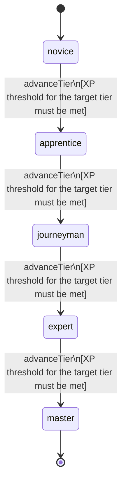

<!-- @generated by @newel/generator-wiki — do not edit -->
---
title: "Alchemy"
---

# Alchemy

`skill`

Brewing potions, reagents, poisons, and catalysts from raw materials. Discovery-driven: recipes are not shown until a player experiments with ingredient combinations.

> Gate consumable power and support ArcaneForging through reagent supply; reward experimentation

## Attributes

| Field | Type | Description |
| ----- | ---- | ----------- |
| tier | `novice`, `apprentice`, `journeyman`, `expert`, `master` |  |
| xpCurve | `linear`, `quadratic`, `exponential` | XP required per tier |
| maxLevel | integer | Maximum XP level within a tier before tier advance is required |
| category | `combat`, `crafting`, `magic`, `exploration`, `social` | Skill domain: crafting |

## States

| State | Description |
| ----- | ----------- |
| `novice` | Entry-level practitioner; basic techniques only |
| `apprentice` | Growing competence; intermediate techniques unlock |
| `journeyman` | Solid practitioner; advanced techniques and profession gates open |
| `expert` | Near-mastery; most advanced abilities available |
| `master` | Complete mastery; all abilities unlocked |

## Actions

### advanceTier

Progress to the next mastery tier through accumulated alchemy XP

**Conditions:**
- XP threshold for the target tier must be met

### brewBasicPotion

Produce a minor healing or stamina potion from common reagents

**Conditions:**
- Requires Alchemy: Novice

### brewEnchantmentCatalyst

Synthesise a magical catalyst used by ArcaneForging to stabilise enchantments

**Conditions:**
- Requires Alchemy: Journeyman

### brewVoidReagent

Distil void-touched materials into a stabilising reagent for void smithing

**Conditions:**
- Requires Alchemy: Expert

