<!-- @generated by @newel/generator-wiki — do not edit -->
---
title: "Arcanist"
---

# Arcanist

`profession`

A practitioner who has married elemental control with enchanting craft, producing the most potent magical items and wielding area-control spells in combat.

> Represent the primary magic-focused profession with both offensive and item-craft capability

## Attributes

| Field | Type | Description |
| ----- | ---- | ----------- |
| status | `locked`, `active`, `mastered` |  |

## Related

| Name | Kind | Target |
| ---- | ---- | ------ |
| elementalMagic | hasOne | [ElementalMagic](elementalmagic.md) |
| enchanting | hasOne | [Enchanting](enchanting.md) |

## States

```mermaid
stateDiagram-v2
  [*] --> locked
  locked --> active : unlock\n[Requires Elemental Magic  Journeyman; Requires Enchanting  Journeyman]
  active --> mastered : master\n[Elemental Magic and Enchanting must both be at master tier]
  mastered --> [*]
```

| State | Description |
| ----- | ----------- |
| `locked` | Prerequisite skill tiers not yet met |
| `active` | Profession is available to the player; provides passive and active bonuses |
| `mastered` | All constituent skills are at master tier; highest-tier profession bonuses active |

## Actions

### unlock

Become available when prerequisite magic skill tiers are reached

**Conditions:**
- Requires Elemental Magic: Journeyman
- Requires Enchanting: Journeyman

### master

Achieve full mastery when all constituent skills reach master tier

**Conditions:**
- Elemental Magic and Enchanting must both be at master tier

