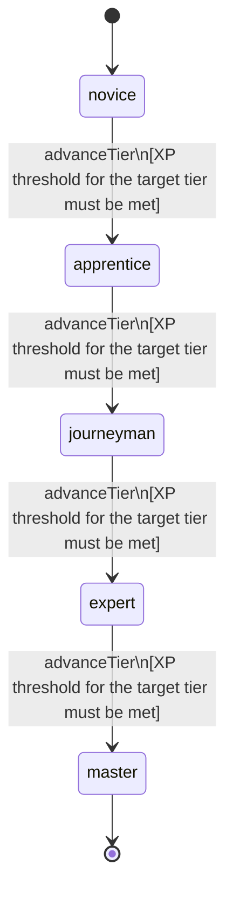

<!-- @generated by @newel/generator-wiki — do not edit -->
---
title: "Archery"
---

# Archery

`skill`

Proficiency with bows and crossbows, covering aim stability, draw timing, and trajectory reading. Enables ranged combat, hunting, and siege support.

> Gate ranged combat capability and enable non-combat uses like hunting and signal flares

## Attributes

| Field | Type | Description |
| ----- | ---- | ----------- |
| tier | `novice`, `apprentice`, `journeyman`, `expert`, `master` |  |
| xpCurve | `linear`, `quadratic`, `exponential` | XP required per tier |
| maxLevel | integer | Maximum XP level within a tier before tier advance is required |
| category | `combat`, `crafting`, `magic`, `exploration`, `social` | Skill domain: combat |

## States

| State | Description |
| ----- | ----------- |
| `novice` | Entry-level practitioner; basic techniques only |
| `apprentice` | Growing competence; intermediate techniques unlock |
| `journeyman` | Solid practitioner; advanced techniques and profession gates open |
| `expert` | Near-mastery; most advanced abilities available |
| `master` | Complete mastery; all abilities unlocked |

## Actions

### advanceTier

Progress to the next mastery tier through accumulated ranged XP

**Conditions:**
- XP threshold for the target tier must be met

### executeSteadyShot

Hold breath to eliminate aim sway for a precise single shot

**Conditions:**
- Requires Archery: Apprentice

### executeMultiShot

Loose three arrows in rapid succession at the same target

**Conditions:**
- Requires Archery: Journeyman

### executePierceShot

Fire a hardened-tip arrow that penetrates armor and hits the target behind

**Conditions:**
- Requires Archery: Expert

