<!-- @generated by @newel/generator-wiki — do not edit -->
---
title: "AshiteBlock"
---

# AshiteBlock

`item`

Quarried ashite stone block cut to standard building dimensions. Dense volcanic stone; excellent heat resistance makes it the preferred material for forges, furnaces, and firebreak walls.

> Construction component from volcanic biomes; creates supply dependency between biome specialists

## Attributes

| Field | Type | Description |
| ----- | ---- | ----------- |
| condition | `pristine`, `worn`, `damaged`, `broken` |  |
| weight | decimal | kg per block |
| rarity | `common`, `uncommon`, `rare`, `epic`, `legendary` |  |
| stackable | boolean | True; stacks up to 20 per slot |
| durability | integer | Structural integrity |

## Related

| Name | Kind | Target |
| ---- | ---- | ------ |
| ashite | hasOne | [Ashite](ashite.md) |

## States

```mermaid
stateDiagram-v2
  [*] --> pristine
  pristine --> worn : degrade\n[Normal use never degrades an ashite block]
  worn --> damaged : degrade\n[Normal use never degrades an ashite block]
  damaged --> broken : degrade\n[Normal use never degrades an ashite block]
  broken --> pristine : repair\n[Requires Carpentry  Apprentice; ashite mortar (aethermite dust + ashite powder) consumed]
  damaged --> pristine : repair\n[Requires Carpentry  Apprentice; ashite mortar (aethermite dust + ashite powder) consumed]
  worn --> pristine : repair\n[Requires Carpentry  Apprentice; ashite mortar (aethermite dust + ashite powder) consumed]
```

| State | Description |
| ----- | ----------- |
| `pristine` | Freshly crafted or repaired; full stat effectiveness |
| `worn` | Showing use; minor stat penalties apply |
| `damaged` | Significantly degraded; notable stat penalties; repair strongly advised |
| `broken` | Unusable; must be repaired at a workshop before use |

## Actions

### degrade

Ashite blocks degrade only under siege weapon impact or prolonged void exposure

**Conditions:**
- Normal use never degrades an ashite block

### repair

Chip-fill damaged blocks with ashite mortar at a masonry bench

**Conditions:**
- Requires Carpentry: Apprentice; ashite mortar (aethermite dust + ashite powder) consumed

