<!-- @generated by @newel/generator-wiki — do not edit -->
---
title: "Blacksmith"
---

# Blacksmith

`profession`

Dedicated metalworker who has combined standard smithing with arcane forging techniques. Produces higher-quality weapons and armour, and can process magical materials unavailable to casual crafters.

> Represent the mid-tier crafting profession that bridges mundane and magical metalwork

## Attributes

| Field | Type | Description |
| ----- | ---- | ----------- |
| status | `locked`, `active`, `mastered` |  |

## Related

| Name | Kind | Target |
| ---- | ---- | ------ |
| smithing | hasOne | [Smithing](smithing.md) |
| arcaneForging | hasOne | [ArcaneForging](arcaneforging.md) |

## States

```mermaid
stateDiagram-v2
  [*] --> locked
  locked --> active : unlock [Requires Smithing Journeyman; Requires Arcane Forging Apprentice]
  active --> mastered : master [Smithing and Arcane Forging must both be at master tier]
  mastered --> [*]
```

| State | Description |
| ----- | ----------- |
| `locked` | Prerequisite skill tiers not yet met |
| `active` | Profession is available to the player; provides passive and active bonuses |
| `mastered` | All constituent skills are at master tier; highest-tier profession bonuses active |

## Actions

### unlock

Become available when prerequisite crafting skill tiers are reached

**Conditions:**
- Requires Smithing: Journeyman
- Requires Arcane Forging: Apprentice

### master

Achieve full mastery when all constituent skills reach master tier

**Conditions:**
- Smithing and Arcane Forging must both be at master tier

