<!-- @generated by @newel/generator-wiki — do not edit -->
---
title: "CarpenterAxe"
---

# CarpenterAxe

`item`

Felling axe with a weighted ferrite head and a duskfiber-wrapped thornwood handle. Balanced for sustained chopping; also functions as a light combat weapon.

> Primary lumber-gathering tool; bridge between crafting and early combat

## Attributes

| Field | Type | Description |
| ----- | ---- | ----------- |
| condition | `pristine`, `worn`, `damaged`, `broken` |  |
| weight | decimal | kg; affects carry capacity |
| rarity | `common`, `uncommon`, `rare`, `epic`, `legendary` |  |
| stackable | boolean | Whether multiple instances stack in inventory |
| durability | integer | Remaining durability points before condition degrades |
| toolType | string | Tool class — the action this tool performs. "pick" mines, "axe" chops. |
| repair | json | Structured repair spec: required station, materials consumed on repair, and skill guards (skill key + minimum tier). |

## Related

| Name | Kind | Target |
| ---- | ---- | ------ |
| ferrite | hasOne | [Ferrite](ferrite.md) |
| thornwood | hasOne | [Thornwood](thornwood.md) |
| duskfiber | hasOne | [Duskfiber](duskfiber.md) |

## States

```mermaid
stateDiagram-v2
  [*] --> pristine
  pristine --> worn : degrade [Hardwood species (Duskfiber trees) degrade the axe faster than softwood]
  worn --> damaged : degrade [Hardwood species (Duskfiber trees) degrade the axe faster than softwood]
  damaged --> broken : degrade [Hardwood species (Duskfiber trees) degrade the axe faster than softwood]
  broken --> pristine : repair [Repair costs one ferrite ingot; handle wrap (duskfiber) does not require replacement]
  damaged --> pristine : repair [Repair costs one ferrite ingot; handle wrap (duskfiber) does not require replacement]
  worn --> pristine : repair [Repair costs one ferrite ingot; handle wrap (duskfiber) does not require replacement]
```

| State | Description |
| ----- | ----------- |
| `pristine` | Freshly crafted or repaired; full stat effectiveness |
| `worn` | Showing use; minor stat penalties apply |
| `damaged` | Significantly degraded; notable stat penalties; repair strongly advised |
| `broken` | Unusable; must be repaired at a workshop before use |

## Actions

### degrade

Reduce durability after chopping use

**Conditions:**
- Hardwood species (Duskfiber trees) degrade the axe faster than softwood

### repair

Restore to pristine condition at a forge

**Conditions:**
- Repair costs one ferrite ingot; handle wrap (duskfiber) does not require replacement

