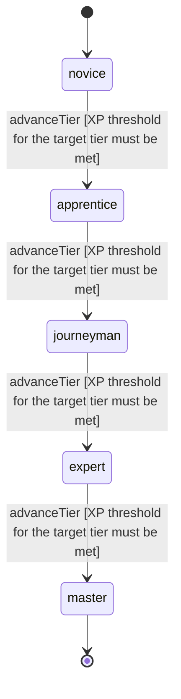

<!-- @generated by @newel/generator-wiki — do not edit -->
---
title: "Carpentry"
---

# Carpentry

`skill`

Working with Thornwood, Duskfiber, and other woody materials to craft furniture, structural building components, hafts, bows, and vehicles.

> Gate construction quality and wooden equipment crafting behind dedicated investment

## Attributes

| Field | Type | Description |
| ----- | ---- | ----------- |
| tier | `novice`, `apprentice`, `journeyman`, `expert`, `master` |  |
| xpCurve | `linear`, `quadratic`, `exponential` | XP required per tier |
| maxLevel | integer | Maximum XP level within a tier before tier advance is required |
| category | `combat`, `crafting`, `magic`, `exploration`, `social` | Skill domain: crafting |

## States

| State | Description |
| ----- | ----------- |
| `novice` | Entry-level practitioner; basic techniques only |
| `apprentice` | Growing competence; intermediate techniques unlock |
| `journeyman` | Solid practitioner; advanced techniques and profession gates open |
| `expert` | Near-mastery; most advanced abilities available |
| `master` | Complete mastery; all abilities unlocked |

## Actions

### advanceTier

Progress to the next mastery tier through accumulated carpentry XP

**Conditions:**
- XP threshold for the target tier must be met

### craftBuildingFrame

Assemble load-bearing wooden frames for player structures

**Conditions:**
- Requires Carpentry: Apprentice

### craftVehicleComponent

Build wagon chassis, ship hulls, or cart frames from seasoned timber

**Conditions:**
- Requires Carpentry: Journeyman

### craftDuskfiberLoom

Construct a Duskfiber processing loom for weaving magical textiles

**Conditions:**
- Requires Carpentry: Expert

