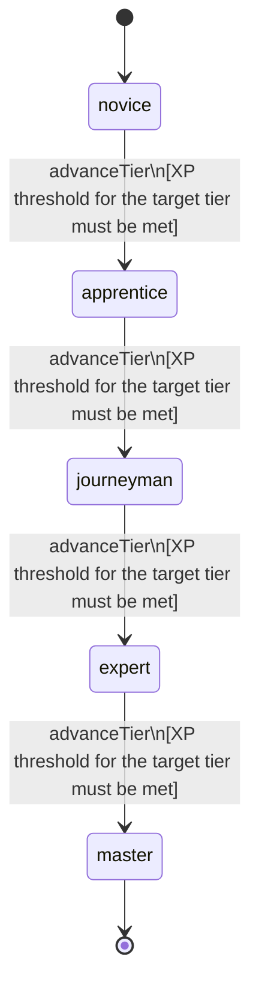

<!-- @generated by @newel/generator-wiki — do not edit -->
---
title: "Cartography"
---

# Cartography

`skill`

Charting unexplored territories and producing maps that can be sold or shared with other players. Higher tiers reveal elevation, resource deposits, and ley-line positions.

> Make exploration economically meaningful and create a player-driven cartography market

## Attributes

| Field | Type | Description |
| ----- | ---- | ----------- |
| tier | `novice`, `apprentice`, `journeyman`, `expert`, `master` |  |
| xpCurve | `linear`, `quadratic`, `exponential` | XP required per tier |
| maxLevel | integer | Maximum XP level within a tier before tier advance is required |
| category | `combat`, `crafting`, `magic`, `exploration`, `social` | Skill domain: exploration |

## States

| State | Description |
| ----- | ----------- |
| `novice` | Entry-level practitioner; basic techniques only |
| `apprentice` | Growing competence; intermediate techniques unlock |
| `journeyman` | Solid practitioner; advanced techniques and profession gates open |
| `expert` | Near-mastery; most advanced abilities available |
| `master` | Complete mastery; all abilities unlocked |

## Actions

### advanceTier

Progress to the next mastery tier through accumulated cartography XP

**Conditions:**
- XP threshold for the target tier must be met

### draftBasicMap

Produce a surface terrain map of a visited region from field notes

**Conditions:**
- Requires Cartography: Apprentice

### draftResourceMap

Overlay a resource deposit layer showing material vein locations

**Conditions:**
- Requires Cartography: Journeyman

### draftLeylineMap

Chart ley-line positions and arcane anomalies invisible to untrained eyes

**Conditions:**
- Requires Cartography: Expert

