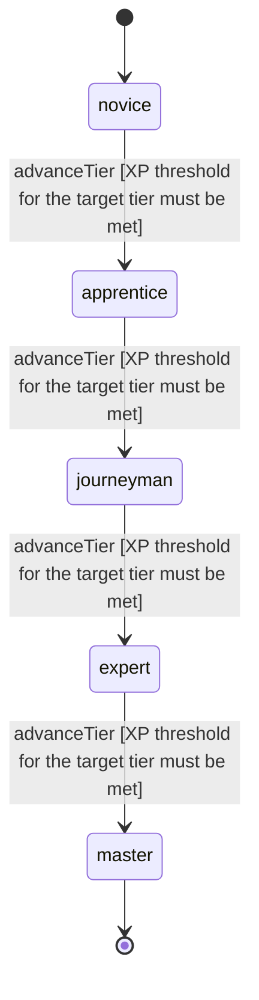

<!-- @generated by @newel/generator-wiki — do not edit -->
---
title: "Diplomacy"
---

# Diplomacy

`skill`

Negotiating with NPC factions, guilds, and governing bodies to obtain favourable terms, treaties, or permissions. Does not work on players — only system-driven entities.

> Gate faction interaction quality behind investment; make non-combat paths viable for territory acquisition

## Attributes

| Field | Type | Description |
| ----- | ---- | ----------- |
| tier | `novice`, `apprentice`, `journeyman`, `expert`, `master` |  |
| xpCurve | `linear`, `quadratic`, `exponential` | XP required per tier |
| maxLevel | integer | Maximum XP level within a tier before tier advance is required |
| category | `combat`, `crafting`, `magic`, `exploration`, `social` | Skill domain: social |

## States

| State | Description |
| ----- | ----------- |
| `novice` | Entry-level practitioner; basic techniques only |
| `apprentice` | Growing competence; intermediate techniques unlock |
| `journeyman` | Solid practitioner; advanced techniques and profession gates open |
| `expert` | Near-mastery; most advanced abilities available |
| `master` | Complete mastery; all abilities unlocked |

## Actions

### advanceTier

Progress to the next mastery tier through accumulated diplomacy XP

**Conditions:**
- XP threshold for the target tier must be met

### negotiateTrade

Broker a favourable trade agreement with an NPC faction

**Conditions:**
- Requires Diplomacy: Apprentice

### proposeTreaty

Submit a formal treaty proposal to an NPC faction for ratification

**Conditions:**
- Requires Diplomacy: Journeyman

### requestTerritoryCession

Petition an NPC faction to yield a land grant in exchange for services or payment

**Conditions:**
- Requires Diplomacy: Expert

