<!-- @generated by @newel/generator-wiki — do not edit -->
---
title: "DuskfiberCloak"
---

# DuskfiberCloak

`item`

Hooded cloak woven from duskfiber bast. Provides minimal physical protection but grants a passive stealth bonus in low-light conditions and dampens magical signature detection.

> Light armour option for Pathfinders and stealth-focused players; tradeoff: protection for concealment

## Attributes

| Field | Type | Description |
| ----- | ---- | ----------- |
| condition | `pristine`, `worn`, `damaged`, `broken` |  |
| weight | decimal | kg |
| rarity | `common`, `uncommon`, `rare`, `epic`, `legendary` |  |
| stackable | boolean | Always false for armour pieces |
| durability | integer | Remaining durability points before condition degrades |

## Related

| Name | Kind | Target |
| ---- | ---- | ------ |
| duskfiber | hasOne | [Duskfiber](duskfiber.md) |

## States

```mermaid
stateDiagram-v2
  [*] --> pristine
  pristine --> worn : degrade\n[Fire damage instantly jumps condition from worn to broken]
  worn --> damaged : degrade\n[Fire damage instantly jumps condition from worn to broken]
  damaged --> broken : degrade\n[Fire damage instantly jumps condition from worn to broken]
  broken --> pristine : repair\n[Requires two duskfiber strands per condition tier restored; Carpentry  Apprentice]
  damaged --> pristine : repair\n[Requires two duskfiber strands per condition tier restored; Carpentry  Apprentice]
  worn --> pristine : repair\n[Requires two duskfiber strands per condition tier restored; Carpentry  Apprentice]
```

| State | Description |
| ----- | ----------- |
| `pristine` | Freshly crafted or repaired; full stat effectiveness |
| `worn` | Showing use; minor stat penalties apply |
| `damaged` | Significantly degraded; notable stat penalties; repair strongly advised |
| `broken` | Unusable; must be repaired at a workshop before use |

## Actions

### degrade

Condition worsens from physical damage and prolonged exposure to fire or acid

**Conditions:**
- Fire damage instantly jumps condition from worn to broken

### repair

Re-weave tears at a crafting bench

**Conditions:**
- Requires two duskfiber strands per condition tier restored
- Carpentry: Apprentice

