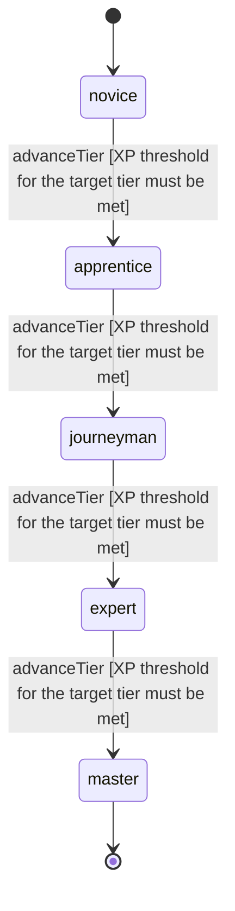

<!-- @generated by @newel/generator-wiki — do not edit -->
---
title: "ElementalMagic"
---

# ElementalMagic

`skill`

Manipulation of the four classical elements — fire, earth, air, and water. The most broadly accessible magical discipline; balanced against martial skill per the MagicBalancedWithMartial design decision.

> Provide the primary magic combat and utility path, balanced against melee in cost and effect

## Attributes

| Field | Type | Description |
| ----- | ---- | ----------- |
| tier | `novice`, `apprentice`, `journeyman`, `expert`, `master` |  |
| xpCurve | `linear`, `quadratic`, `exponential` | XP required per tier |
| maxLevel | integer | Maximum XP level within a tier before tier advance is required |
| category | `combat`, `crafting`, `magic`, `exploration`, `social` | Skill domain: magic |

## States

| State | Description |
| ----- | ----------- |
| `novice` | Entry-level practitioner; basic techniques only |
| `apprentice` | Growing competence; intermediate techniques unlock |
| `journeyman` | Solid practitioner; advanced techniques and profession gates open |
| `expert` | Near-mastery; most advanced abilities available |
| `master` | Complete mastery; all abilities unlocked |

## Actions

### advanceTier

Progress to the next mastery tier through accumulated elemental XP

**Conditions:**
- XP threshold for the target tier must be met

### castElementalBolt

Hurl a single-element bolt of fire, earth, air, or water at a target

**Conditions:**
- Requires Elemental Magic: Apprentice

### castElementalField

Conjure a persistent area-of-effect field that applies elemental conditions

**Conditions:**
- Requires Elemental Magic: Journeyman

### castElementalStorm

Unleash a wide elemental storm; high mana cost, massive area damage

**Conditions:**
- Requires Elemental Magic: Expert

