<!-- @generated by @newel/generator-wiki — do not edit -->
---
title: "EnchantedAethermiteShard"
---

# EnchantedAethermiteShard

`item`

A refined aethermite shard that has been fully imbued at an arcane forge. Emits a faint silver glow; consumed as a single-use catalyst when enchanting metals or imbuing equipment.

> Primary enchanting catalyst; creates scarcity that balances the enchanting economy

## Attributes

| Field | Type | Description |
| ----- | ---- | ----------- |
| condition | `pristine`, `worn`, `damaged`, `broken` |  |
| weight | decimal | kg per shard |
| rarity | `common`, `uncommon`, `rare`, `epic`, `legendary` |  |
| stackable | boolean | True; stacks up to 10 per slot |
| durability | integer | Charge level; 0 means the shard is spent |

## Related

| Name | Kind | Target |
| ---- | ---- | ------ |
| aethermite | hasOne | [Aethermite](aethermite.md) |

## States

```mermaid
stateDiagram-v2
  [*] --> pristine
  pristine --> worn : degrade [Exposed to sunlight charge degrades one tier per in-game day]
  worn --> damaged : degrade [Exposed to sunlight charge degrades one tier per in-game day]
  damaged --> broken : degrade [Exposed to sunlight charge degrades one tier per in-game day]
  broken --> pristine : repair [Requires Arcane Forging Journeyman; Recharging costs one aethermite dust and restores condition to pristine]
  damaged --> pristine : repair [Requires Arcane Forging Journeyman; Recharging costs one aethermite dust and restores condition to pristine]
  worn --> pristine : repair [Requires Arcane Forging Journeyman; Recharging costs one aethermite dust and restores condition to pristine]
```

| State | Description |
| ----- | ----------- |
| `pristine` | Freshly crafted or repaired; full stat effectiveness |
| `worn` | Showing use; minor stat penalties apply |
| `damaged` | Significantly degraded; notable stat penalties; repair strongly advised |
| `broken` | Unusable; must be repaired at a workshop before use |

## Actions

### degrade

Charge dissipates slowly when not stored in a magical container

**Conditions:**
- Exposed to sunlight: charge degrades one tier per in-game day

### repair

A fully discharged shard can be recharged at an arcane forge

**Conditions:**
- Requires Arcane Forging: Journeyman
- Recharging costs one aethermite dust and restores condition to pristine

