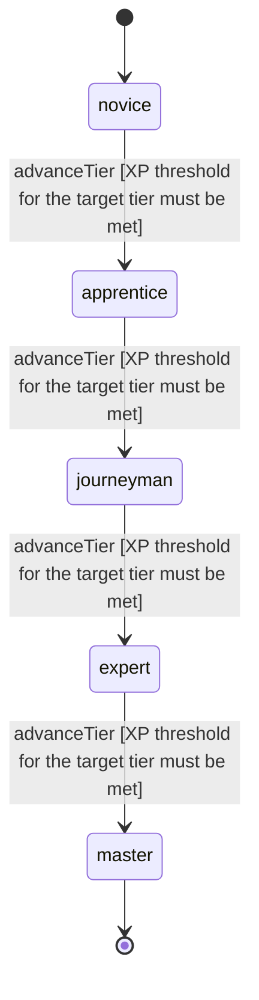

<!-- @generated by @newel/generator-wiki — do not edit -->
---
title: "Enchanting"
---

# Enchanting

`skill`

Imbuing refined items and materials with persistent magical effects using aethermite catalysts. Enchanting strength and complexity scale with tier; requires ArcaneForging-produced components.

> Gate item enchantment behind combined magic and crafting investment; make enchanted gear feel earned

## Attributes

| Field | Type | Description |
| ----- | ---- | ----------- |
| tier | `novice`, `apprentice`, `journeyman`, `expert`, `master` |  |
| xpCurve | `linear`, `quadratic`, `exponential` | XP required per tier |
| maxLevel | integer | Maximum XP level within a tier before tier advance is required |
| category | `combat`, `crafting`, `magic`, `exploration`, `social` | Skill domain: magic |

## States

| State | Description |
| ----- | ----------- |
| `novice` | Entry-level practitioner; basic techniques only |
| `apprentice` | Growing competence; intermediate techniques unlock |
| `journeyman` | Solid practitioner; advanced techniques and profession gates open |
| `expert` | Near-mastery; most advanced abilities available |
| `master` | Complete mastery; all abilities unlocked |

## Actions

### advanceTier

Progress to the next mastery tier through accumulated enchanting XP

**Conditions:**
- XP threshold for the target tier must be met

### applyMinorEnchantment

Bind a simple single-property enchantment to a refined item

**Conditions:**
- Requires Enchanting: Apprentice

### applyCompoundEnchantment

Layer two compatible enchantments onto a single item without cancellation

**Conditions:**
- Requires Enchanting: Journeyman

### applyVoidBinding

Bind a void-aligned enchantment onto a voidite-core item using VoidSmithing co-processing

**Conditions:**
- Requires Enchanting: Expert
- Requires Void Smithing: Expert

