<!-- @generated by @newel/generator-wiki — do not edit -->
---
title: "Ferrite"
---

# Ferrite

`material`

Common dark-grey metal found in surface veins across temperate biomes, volcanic lava-tube edges, and stabilised sections of void rifts. Abundant but brittle when thin; the backbone of early-game tooling.

> Serve as the entry-level metallic material, readily available to new players

## Attributes

| Field | Type | Description |
| ----- | ---- | ----------- |
| state | `raw`, `refined`, `enchanted` |  |
| density | decimal | g/cm³; governs item weight |
| hardness | decimal | Mohs-equivalent scale 1–10 |
| conductivity | decimal | Thermal conductivity rating 0–1 |
| magicAffinity | decimal | Capacity to hold enchantment 0–1 |

## States

```mermaid
stateDiagram-v2
  [*] --> raw
  raw --> refined : refine [Requires a functional forge structure; Two raw ferrite ore yield one refined ingot]
  refined --> enchanted : enchant [Ferrite holds weak enchantments only; magical capacity capped at 0.3; Enchanting consumes one enchanted aethermite shard as a catalyst; Aethermite.consume is invoked on the spent shard — the shard transitions to consumed state and is removed from inventory entirely]
  enchanted --> [*]
```

| State | Description |
| ----- | ----------- |
| `raw` | Ore or unprocessed form; must be smelted or worked before use |
| `refined` | Processed ingot or sheet; ready for crafting |
| `enchanted` | Imbued with magical energy at an arcane forge |

## Actions

### refine

Smelt raw ferrite ore into refined ingots at a forge

**Conditions:**
- Requires a functional forge structure
- Two raw ferrite ore yield one refined ingot

### enchant

Imbue a refined ingot at an arcane forge to unlock enchanted state

**Conditions:**
- Ferrite holds weak enchantments only; magical capacity capped at 0.3
- Enchanting consumes one enchanted aethermite shard as a catalyst; Aethermite.consume is invoked on the spent shard — the shard transitions to consumed state and is removed from inventory entirely

