<!-- @generated by @newel/generator-wiki — do not edit -->
---
title: "FerritePick"
---

# FerritePick

`item`

Rough-hewn mining pick forged from ferrite ingots and a thornwood handle. The standard tool for extracting surface ore veins; wears quickly against hard rock.

> Entry-level mining tool; gates ore gathering for new players

## Attributes

| Field | Type | Description |
| ----- | ---- | ----------- |
| condition | `pristine`, `worn`, `damaged`, `broken` |  |
| weight | decimal | kg; affects carry capacity |
| rarity | `common`, `uncommon`, `rare`, `epic`, `legendary` |  |
| stackable | boolean | Whether multiple instances stack in inventory |
| durability | integer | Remaining durability points before condition degrades |
| toolType | string | Tool class — the action this tool performs. "pick" mines, "axe" chops. |
| repair | json | Structured repair spec: required station, materials consumed on repair, and skill guards (skill key + minimum tier). |

## Related

| Name | Kind | Target |
| ---- | ---- | ------ |
| ferrite | hasOne | [Ferrite](ferrite.md) |
| thornwood | hasOne | [Thornwood](thornwood.md) |

## States

```mermaid
stateDiagram-v2
  [*] --> pristine
  pristine --> worn : degrade [Each mining action consumes durability points scaled by rock hardness]
  worn --> damaged : degrade [Each mining action consumes durability points scaled by rock hardness]
  damaged --> broken : degrade [Each mining action consumes durability points scaled by rock hardness]
  broken --> pristine : repair [Requires a functional forge; Repair costs one ferrite ingot per condition tier restored]
  damaged --> pristine : repair [Requires a functional forge; Repair costs one ferrite ingot per condition tier restored]
  worn --> pristine : repair [Requires a functional forge; Repair costs one ferrite ingot per condition tier restored]
```

| State | Description |
| ----- | ----------- |
| `pristine` | Freshly crafted or repaired; full stat effectiveness |
| `worn` | Showing use; minor stat penalties apply |
| `damaged` | Significantly degraded; notable stat penalties; repair strongly advised |
| `broken` | Unusable; must be repaired at a workshop before use |

## Actions

### degrade

Reduce durability after mining use; condition worsens when durability threshold crossed

**Conditions:**
- Each mining action consumes durability points scaled by rock hardness

### repair

Restore item to pristine condition at a forge using raw ferrite

**Conditions:**
- Requires a functional forge
- Repair costs one ferrite ingot per condition tier restored

