<!-- @generated by @newel/generator-wiki — do not edit -->
---
title: "FerriteShield"
---

# FerriteShield

`item`

Round shield of ferrite-plated hardwood. Blocks melee and missile strikes at the cost of mobility; the standard off-hand defence for early-game fighters.

> Provide an entry-level off-hand defensive option for shield-wielding characters

## Attributes

| Field | Type | Description |
| ----- | ---- | ----------- |
| condition | `pristine`, `worn`, `damaged`, `broken` |  |
| weight | decimal | kg |
| rarity | `common`, `uncommon`, `rare`, `epic`, `legendary` |  |
| stackable | boolean | Always false for shields |
| durability | integer | Remaining durability points before condition degrades |
| equipmentSlot | string | Equipment slot — what is equipped (§6) |
| deformationMode | string | SKINNED \| RIGID \| HYBRID (§10) |
| masks | json | Color/mask regions present on the asset (§17) |
| hideRegions | json | Body regions this item hides to prevent clipping (§16) |
| attachments | json | Attachment state → socket map (§7) |
| minLodLevel | integer | Coarsest LOD at which this part still renders (§35) |
| size | json | Placeholder mesh extents [x, y, z] |
| metalTone | string | Metal tone for metal-mask regions (§21) |
| emissionColor | integer | Palette index in the emission region (192–223) for emissive regions (§22) |
| compatibleTags | json | Semantic tags required to equip (§39) |

## Related

| Name | Kind | Target |
| ---- | ---- | ------ |
| ferrite | hasOne | [Ferrite](ferrite.md) |

## States

```mermaid
stateDiagram-v2
  [*] --> pristine
  pristine --> worn : degrade [Blocking heavy or void attacks degrades the shield at double rate]
  worn --> damaged : degrade [Blocking heavy or void attacks degrades the shield at double rate]
  damaged --> broken : degrade [Blocking heavy or void attacks degrades the shield at double rate]
  broken --> pristine : repair [Requires one ferrite ingot; Smithing Novice]
  damaged --> pristine : repair [Requires one ferrite ingot; Smithing Novice]
  worn --> pristine : repair [Requires one ferrite ingot; Smithing Novice]
```

| State | Description |
| ----- | ----------- |
| `pristine` | Freshly crafted or repaired; full stat effectiveness |
| `worn` | Showing use; minor stat penalties apply |
| `damaged` | Significantly degraded; notable stat penalties; repair strongly advised |
| `broken` | Unusable; must be repaired at a workshop before use |

## Actions

### degrade

Condition worsens as the shield absorbs blows

**Conditions:**
- Blocking heavy or void attacks degrades the shield at double rate

### repair

Re-plate and re-band the shield at a forge

**Conditions:**
- Requires one ferrite ingot; Smithing: Novice

